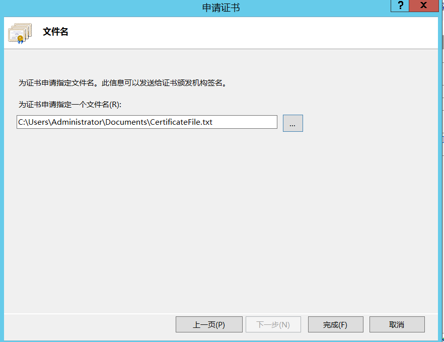

# 配置认证

> 2017-12-14 驻云DBA组

[TOC]

> 目标

0. 准备:“步骤1.配置域控服务器“已经完成并添加了域用户”
1. 添加角色“Active Directory证书服务”和“Web服务器(IIS)”
2. 配置Active Directory证书服务
3. 项目配置IIS管理器和导出云访问证书文件
4. 将根证书导入到其他域内的服务器上。

## 0. 准备

### A. 步骤1.设置域控服务器”已完成

### B. 将“域用户”添加到“IIS_IUSRS”中。

对于域控制器服务器进行一下操作：

在Server管理器中，单击“Active Directory用户和计算机”。

并将“域用户”添加到“IIS_IUSRS”的“成员”中。

对于其他在此域控内的服务器，请通过“控制面板”打开表单，然后将“域用户”添到“IIS_IUSRS”中。

> 以下为对IIS服务器上进行的操作，其他服务器类似

进入“编辑本地用户和组”后进入管理界面，选择“groups组”中的“IIS_USERS”，进入IIS_USERS属性管理界面。

## 1 .添加角色“Active Directory证书服务”和“Web服务器(IIS)”

登陆到web服务器，配置ADCC和IIS。

在服务器管理器中，选择“添加角色和特性”。

单击“下一步”- >“下一步”- >…选择选择“Active Directory 证书服务”和“Web服务器（IIS）”

点击“Next”，然后选择ASP.Net(以下步骤需要安装)

选择所有角色服务:

确认安装所选内容，保持默认设置，单击“Next”- >“Next”

保持默认设置,单击“下一步”- >“下一步”- >…- >“安装”。

## 2. 配置Active Directory证书服务

### A. 点击右上角的"!"图标，点击“将此服务器推广到域控制器”

单击“下一步”。
试着选择所有的，但这次你只能选择4个选项。

保持默认设置,单击“下一步”- >“下一步”- >…

把名字改为简单的名字:

单击“下一步”- >“下一步”- >…
选择“用户名和密码”。

单击“下一步”- >“下一个”。

选择“稍后选择并为SSL分配一个证书”

单击“下一步”- >“配置”

### B. 在此配置之后系统会弹出:

单击“是”。
以上的“AD CS配置”向导将再次显示。
单击“下一步”- >“下一个”。
选择所有角色服务。

点击“下一步”，选择“指定服务帐户”。

这一步之前一定要完成"将域控用户添加到IIS_USERS中“，所有的服务器都用域控用户登陆操作。

单击“下一步”- >“下一个”…

选择“toberoot-CA”。

单击“下一步t”和“配置”。

## 3. 项目配置IIS管理器和导出云证书文件

### A. 下载CA根证书

打开服务器管理器，单击(IIS)管理器
在IIS管理器中，单击http地址:

下面的页面是开放的

点击“下载CA证书，证书链，或CRL”，然后:

单击“下载CA证书”链接下载CA根证书，并使用默认名称“certnew.cer”保存证书文件。

### B. 创建证书请求

在IIS管理器中，单击“服务器证书”

选择Web服务器和“创建证书请求…”,然后设置属性的常用名*。域,如“.BACloud.com”。

点击“下一步”并设置文件名，“完成”。

### C. 下载证书

如一个。再次打开页面:

点击“申请证书”

点击“高级证书请求”。

点击“…base - 64编码…”

输入所有复制的内容。在步骤B中保存的txt文件，选择“Web服务器”作为模板。

点击“提交”

点击“下载证书”下载带有默认名称“certnew(1)”的文件。你可以把它改成“certnew2 . cer”。

### D. 完成证书请求

在IIS管理器中,选择域,单击“完成证书请求…”。

选择保存在上述步骤C中的第二个证书文件。，并设置一个友好的名字，如“BACloud”。

点击“OK”回到IIS管理器，创建了新的行。
右键单击当前创建的新行，选择“Export”导出认证和输入密码并保存。可以文件。

## 4. 将根证书导入到其他人的pc。

复制在上述步骤3中创建的根证书。

### A. 到其他领域的个人电脑。

运行“MMC”命令打开控制台窗体。

### B. 在文件中,选择“添加/删除管理单元…”

选择“添加”> >“证书”。
选择“计算机帐户”

点击“下一步”- >“完成”。

### C. 右键单击:- >证书信任根…- >证书,选择“所有任务”和“导入…”

进入导入证书向导

导入根证书文件。

点击“下一步”,选择“把所有certifcates…”

单击“下一步”- >“完成”。

导入成功

### D. 您可以检查证书是否正确导入后，在SLD安装后，尝试连接SLD，并检查没有认证错误。
如果出现问题，请检查防火墙是否“关闭”。