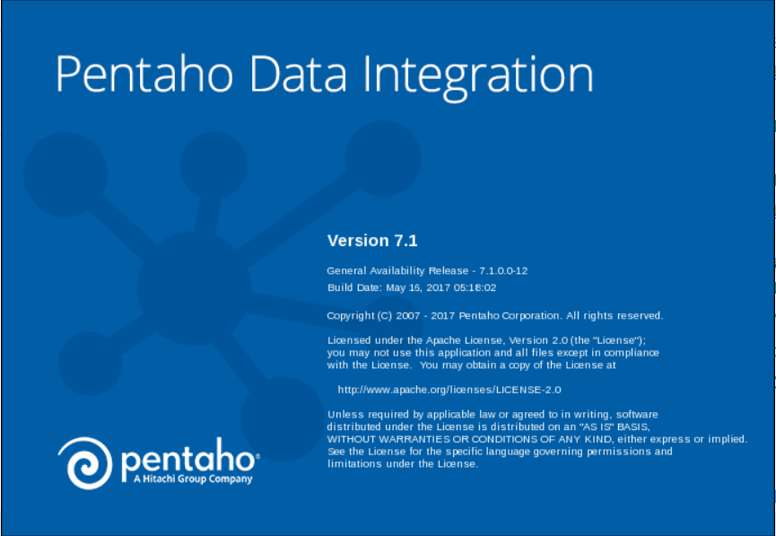
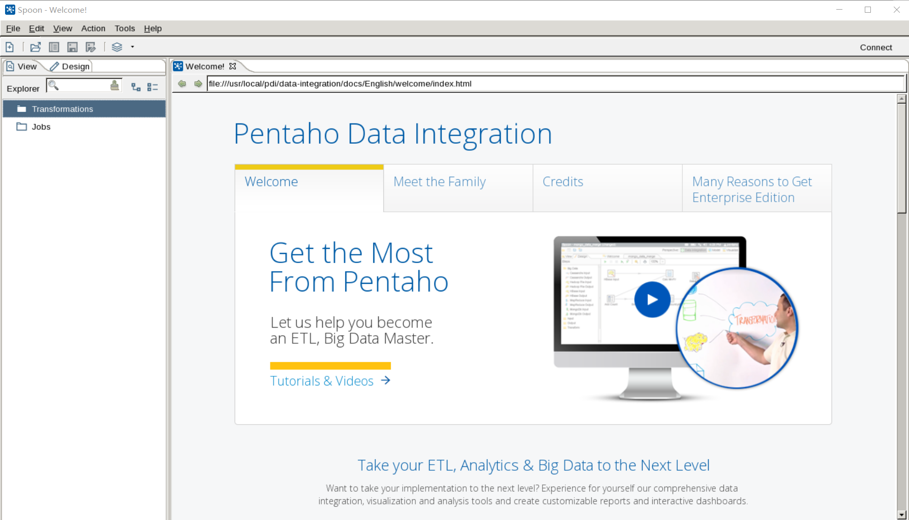

# 安装kettle|pentaho7.1

## 官网

http://www.pentaho.com/download

## 安装步骤

1. 安装图形化界面
2. 安装依赖包jdk 1.8
3. 安装pentaho 7.1


```shell
# 查看系统操作系统发行版和内核版本
[root@ToBeRoot opt]# cat /etc/redhat-release 
CentOS release 6.8 (Final)
[root@ToBeRoot opt]# uname -r
2.6.32-642.13.1.el6.i686

# 安装图形化界面
[root@ToBeRoot opt]# yum -y groupinstall "X Window System"

# 安装lib库
[root@ToBeRoot opt]# yum install -y gtk2* PackageKit-gtk* libcanberra-gtk2 webkitgtk

# 安装jdk，宣告java家目录
[root@ToBeRoot opt]# rpm -ivh jdk-8u131-linux-i586.rpm

[root@ToBeRoot opt]# vim /etc/basrhc
export JAVA_HOME=/usr/java/jdk1.8.0_131/
export JRE_HOME=/usr/java/jdk1.8.0_131/jre/
export CLASSPATH=.:$JAVA_HOME/lib:$JAVA_HOME/jre/lib:$CLASSPATH
[root@ToBeRoot opt]# source /etc/bashrc
[root@ToBeRoot opt]# java -version

# 安装pentaho7.1
下载解压即可，已经编译过了
[root@ToBeRoot ~]# ls ~
pdi-ce-7.1.0.0-12.zip  
[root@ToBeRoot ~]# unzip pdi-ce-7.1.0.0-12.zip -d /usr/local/pdi/
[root@ToBeRoot ~]# cd /usr/local/pdi
[root@ToBeRoot pdi]# pwd
/usr/local/pdi
[root@ToBeRoot pdi]# ls
data-integration
[root@ToBeRoot pdi]# cd data-integration/
[root@ToBeRoot data-integration]# ls
adaptive-execution        hs_err_pid13055.log  LICENSE.txt                               runSamples.bat         SpoonConsole.bat
Carte.bat                 hs_err_pid13247.log  logs                                      runSamples.sh          SpoonDebug.bat
carte.sh                  Import.bat           Pan.bat                                   samples                SpoonDebug.sh
classes                   import-rules.xml     pan.sh                                    set-pentaho-env.bat    spoon.ico
core.13247                import.sh            PentahoDataIntegration_OSS_Licenses.html  set-pentaho-env.sh     spoon.png
Data Integration.app      Kitchen.bat          plugins                                   simple-jndi            spoon.sh
Data Service JDBC Driver  kitchen.sh           purge-utility.bat                         Spark-app-builder.bat  system
docs                      launcher             purge-utility.sh                          spark-app-builder.sh   ui
Encr.bat                  lib                  pwd                                       Spoon.bat              yarn.sh
encr.sh                   libswt               README.txt                                spoon.command
[root@ToBeRoot data-integration]# ls /opt
blog                                    jdk-8u131-linux-i586.rpm                            ????_phpems_zxmnks_v4.0  shellscripts
consul_0.8.5_linux_386.zip              jspvz                                               phpredis-master          testdir
edusoho-7.5.12.tar.gz                   master.zip                                          redis-3.0.3.tar.gz       testdir.tar
hins2883083_data_20170629152533.tar.gz  percona-toolkit-3.0.3-rf61508f-el6-i386-bundle.tar  redis-3.2.9.tar.gz       ybzbxt_v2.0.1


[root@ToBeRoot data-integration]#  vim /etc/basrhc
# kettle 
export SPOON_HOME=/usr/local/pdi/data-integration
export KETTLE_HOME=/usr/local/pdi/data-integration
export KITCHEN_HOME=/usr/local/pdi/data-integration
alias spoon='/usr/local/pdi/data-integration/spoon.sh'
alias kettle='/usr/local/pdi/data-integration/spoon.sh'
alias kitchen='/usr/local/pdi/data-integration/kitchen.sh'
export OPT="-Dorg.eclipse.swt.browser.XULLRunnerPath=/dev/null -Dorg.eclipse.swt.internal.gtk.cairoGraphics=false"
[root@ToBeRoot data-integration]# bash /etc/bashrc

# 启动kettle图形化程序spoon.sh
[root@ToBeRoot data-integration]# ./spoon.sh 
[root@ToBeRoot data-integration]# ulimit -c unlimited
[root@ToBeRoot data-integration]# ./spoon.sh 
```



