# JDBC连接DRDS故障

[TOC]

# 1.需求

## 1.1. 故障描述

【故障现象】DRDS经常通过JDBC会连接超时，但是当时DRDS负载及连接数都不高。

【故障频率】2017年7月1日开始正式使用这套系统

（一）2017年7月8日下午2点到4点之间又出现连接超时现象。具体报错见下图。

（二）2017年7月9日全天都有问题。报错日志还没有提供

【联系方式】

联系人1：

联系人2：

【系统权限】


【报错日志】

20170708报错：

 

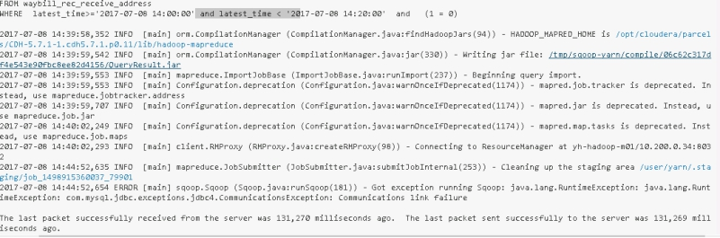 

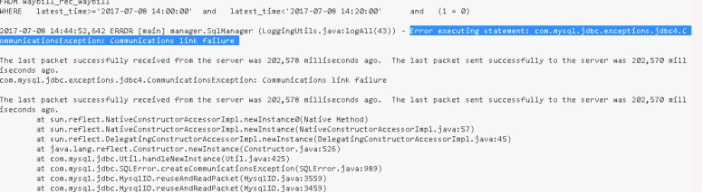 

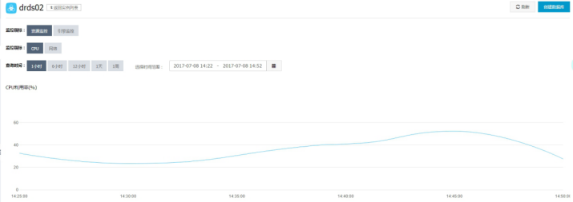 

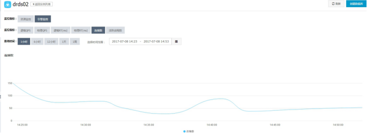 

20170709报错：

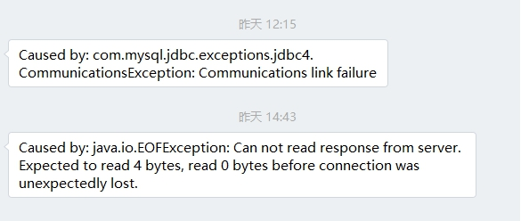 

## 1.2. 信息获取

【架构信息】

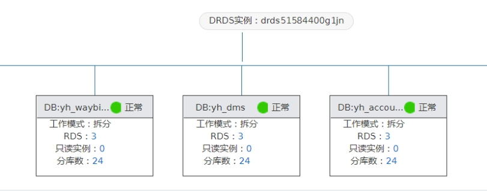 

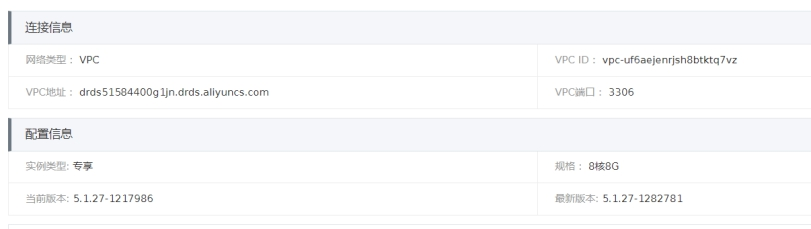 

【监控信息】

其中一台后端RDS

 

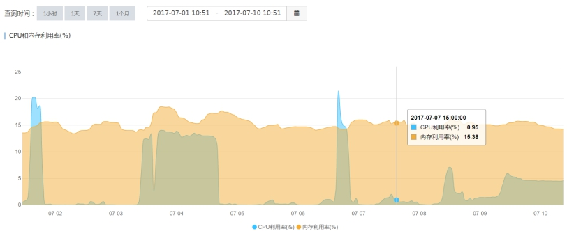 

 

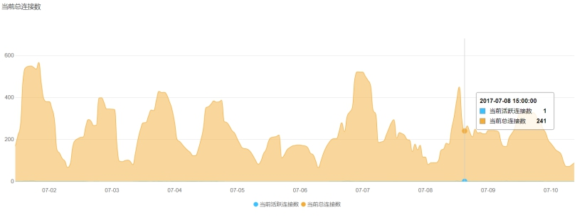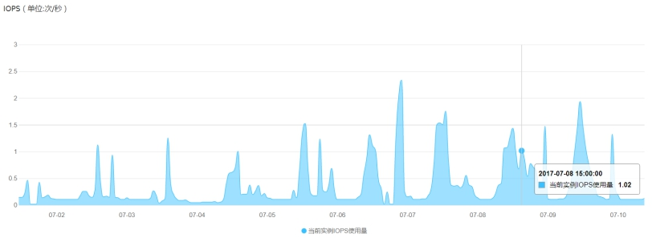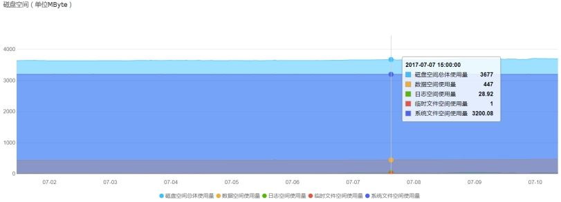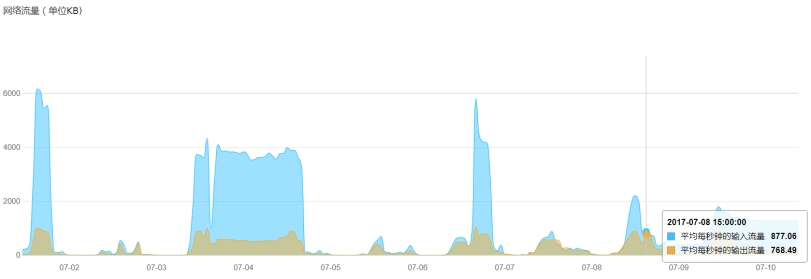 

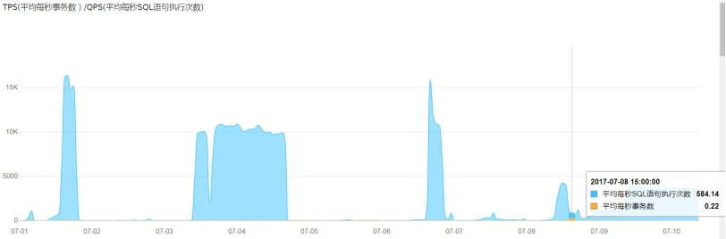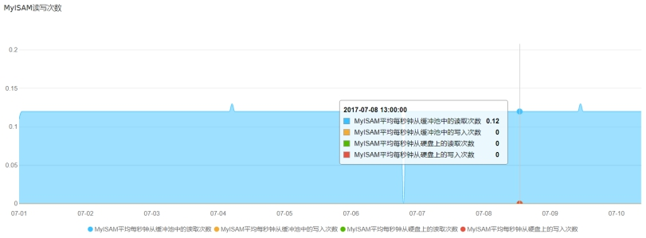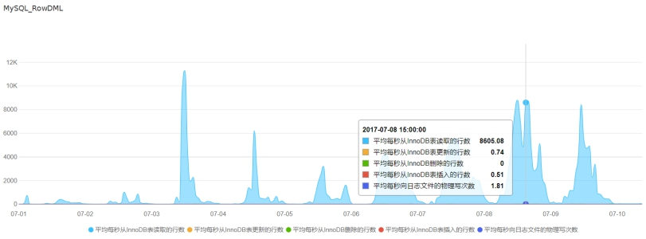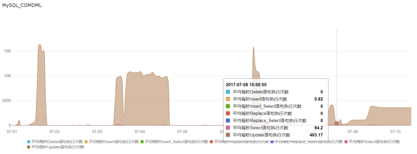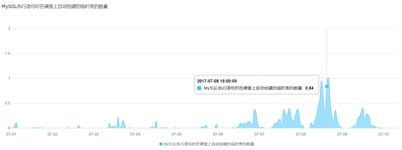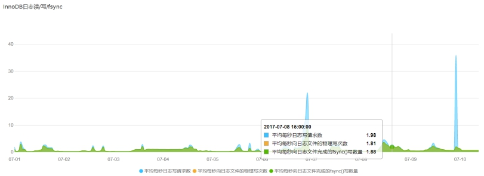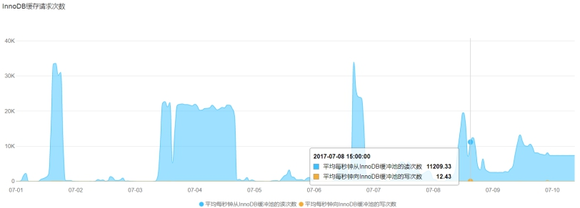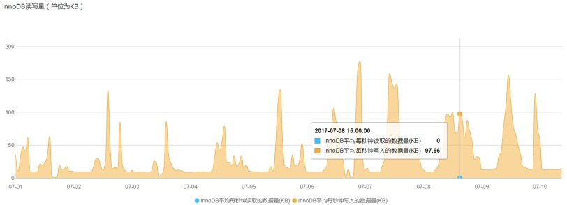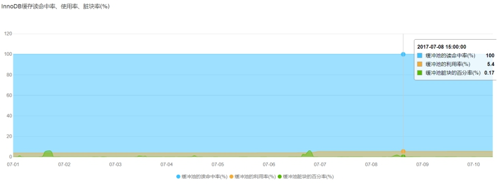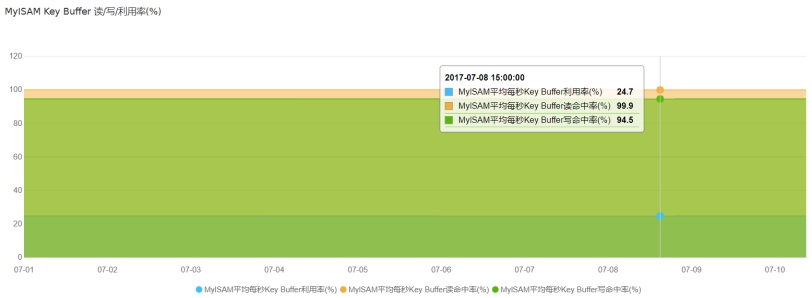 

【参数配置】

```shell
auto_increment_increment = 1

auto_increment_offset = 1

back_log = 3000

binlog_cache_size = 2048KB

binlog_checksum = CRC32

binlog_row_image = full

binlog_stmt_cache_size = 32768

character_set_server = utf8

concurrent_insert = 1

connect_timeout = 10

default_storage_engine = InnoDB

default_time_zone = SYSTEM

default_week_format = 0

delayed_insert_limit = 100

delayed_insert_timeout = 300

delayed_queue_size = 1000

delay_key_write = ON

div_precision_increment = 4

eq_range_index_dive_limit = 10

explicit_defaults_for_timestamp = false

ft_min_word_len = 4

ft_query_expansion_limit = 20

group_concat_max_len = 1024

innodb_adaptive_hash_index = ON

innodb_additional_mem_pool_size = 2097152

innodb_autoinc_lock_mode = 1

innodb_concurrency_tickets = 5000

innodb_ft_max_token_size = 84

innodb_ft_min_token_size = 3

innodb_large_prefix = OFF

innodb_lock_wait_timeout = 50

innodb_max_dirty_pages_pct = 75

innodb_old_blocks_pct = 37

innodb_old_blocks_time = 1000

innodb_online_alter_log_max_size = 134217728

innodb_open_files = 3000

innodb_print_all_deadlocks = OFF

innodb_purge_batch_size = 300

innodb_purge_threads = 1

innodb_read_ahead_threshold = 56

innodb_read_io_threads = 4

innodb_rollback_on_timeout = OFF

innodb_stats_method = nulls_equal

innodb_stats_on_metadata = OFF

innodb_stats_sample_pages = 8

innodb_strict_mode = OFF

innodb_table_locks = ON

innodb_thread_concurrency = 0

innodb_thread_sleep_delay = 10000

innodb_write_io_threads = 4

interactive_timeout = 7200****

key_cache_age_threshold = 300

key_cache_block_size = 1024

key_cache_division_limit = 100

log_queries_not_using_indexes = OFF

long_query_time = 1

loose_max_statement_time = 0

loose_rds_indexstat = OFF

loose_rds_max_tmp_disk_space = 10737418240

loose_rds_tablestat = OFF

loose_rds_threads_running_high_watermark = 50000

loose_tokudb_buffer_pool_ratio = 0

low_priority_updates = 0

max_allowed_packet = 1024M

max_connect_errors = 100

max_length_for_sort_data = 1024

max_prepared_stmt_count = 16382

max_write_lock_count = 102400

myisam_sort_buffer_size = 262144

net_read_timeout = 30

net_retry_count = 10

net_write_timeout = 60

open_files_limit = 65535

performance_schema = OFF

query_alloc_block_size = 8192

query_cache_limit = 1048576

query_cache_size = 3145728

query_cache_type = 0

query_cache_wlock_invalidate = OFF

query_prealloc_size = 8192

rds_reset_all_filter = 0

slow_launch_time = 2

sql_mode = 

table_definition_cache = 512

table_open_cache = 2000

thread_stack = 262144

tmp_table_size = 2097152

transaction_isolation = READ-COMMITTED

wait_timeout = 86400

```


# 2. 分析

| id   | 时间                  | 报错信息                                     | 详细内容                         |
| ---- | ------------------- | ---------------------------------------- | ---------------------------- |
| 1    | 2017-07-08 14:44:52 | mysql.jdbc.exceptions.jdbc4.ConnectionException | conmunication link fail      |
| 2    | 2017-07-08 15:51:08 | mysql.jdbc.exceptions.jdbc4.MysqlNonTransientConnectionException | the server has been shutdown |

客户截图中的两个报错信息

 

RDS 默认设置连接超时时间的参数有两个：

【wait_timeout = 86400】

【interactive_timeout = 7200】

【wait_timeout\interactive_timeout】值为mysql在关闭一个交互式/非交互式的连接之前所要等待的时间。建议不需要设置太长的时候，否则会占用实例的连接数资源。

分别为24小时和2小时，同一时间，这两个参数只有一个起作用。到底是哪个参数起作用，和用户连接时指定的连接参数相关，缺省情况下是使用wait_timeout。如果应用程序的连接超过24小时没有新的动作，那么RDS就会断开此连接。

**【故障原因】**

**原因可能性有：**

1. drds url连接有问题；

2. 应用端连接闲置超时而被 MySQL 断开

# 3. 解决方案

第一原因需要客户等再次出现的时候再观察一下url连接是否有效。我这边也发工单给阿里了。

第二个原因的解决建议如下。

建议：

1）数据库层：将wait_timeout值设为最大**259200**

2）应用开发层：减少连接池内连接的生存周期，使之小于上一项中所设置的 wait_timeout 的值；或者定期使用连接池内的连接，使得它们不会因为闲置超时而被 MySQL 断开。

例如：

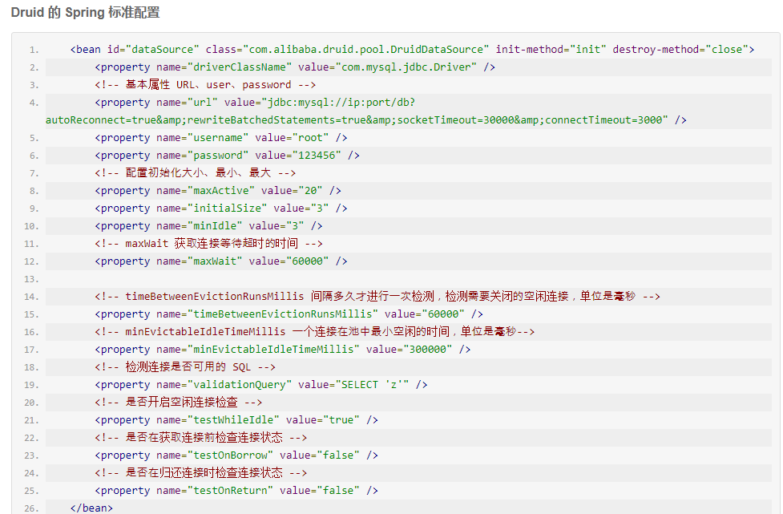 

 

参考：

[https://help.aliyun.com/knowledge_detail/41714.html](https://help.aliyun.com/knowledge_detail/41714.html)

[https://help.aliyun.com/document_detail/51475.html?spm=5176.doc29668.6.624.QJeTt1](https://help.aliyun.com/document_detail/51475.html?spm=5176.doc29668.6.624.QJeTt1)