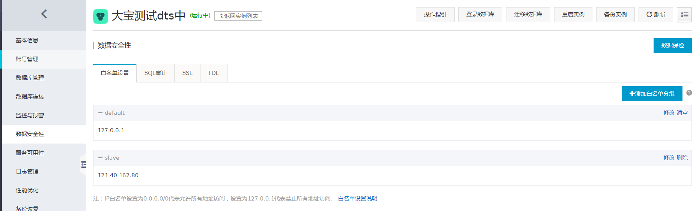
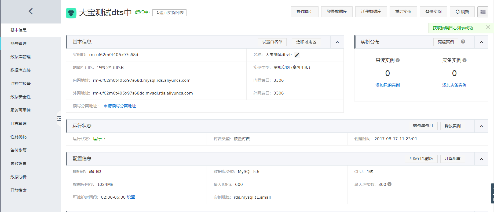
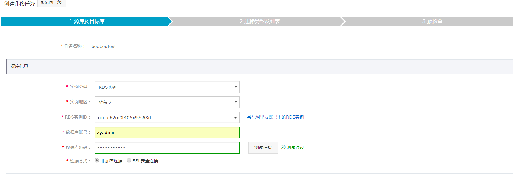
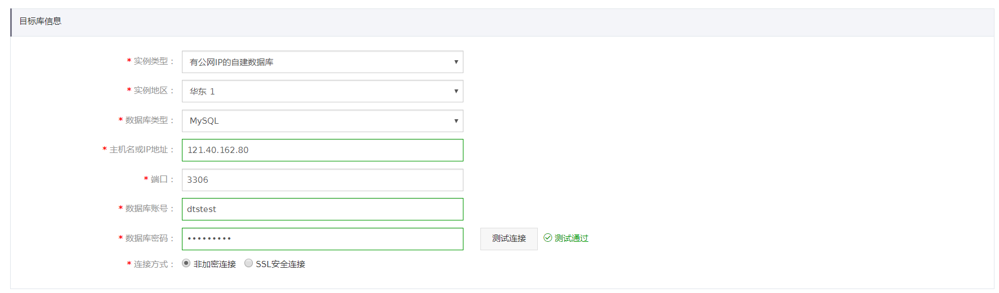
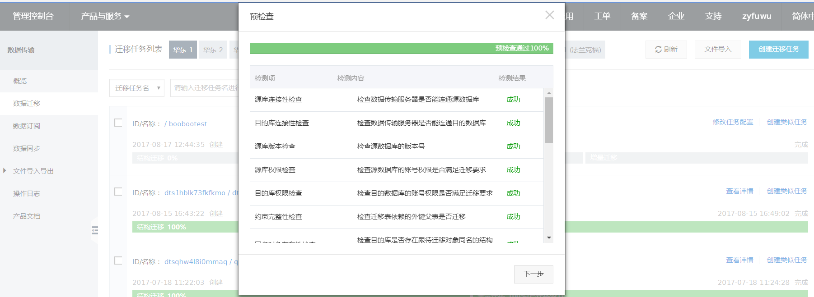
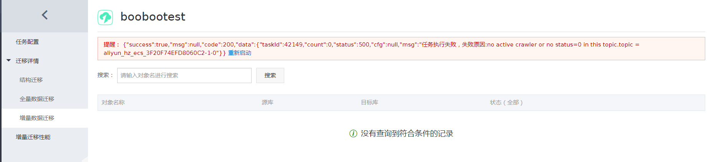
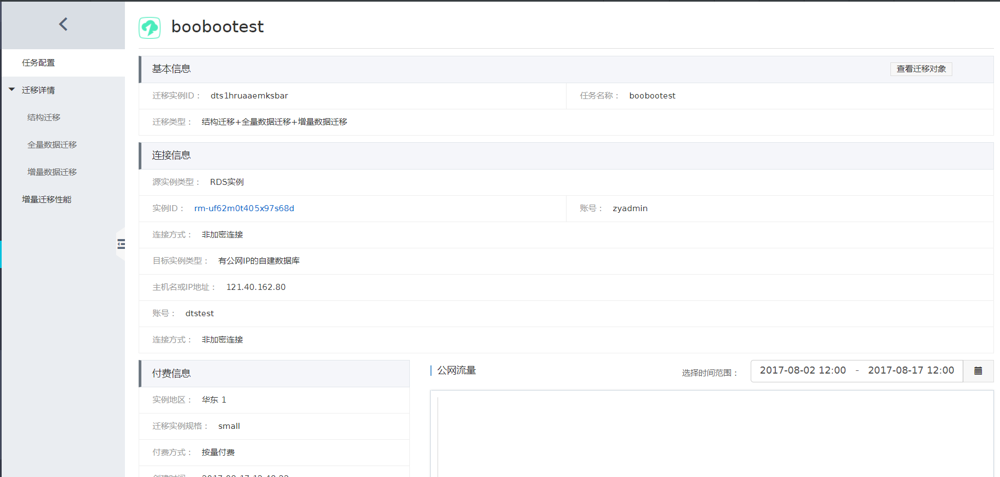
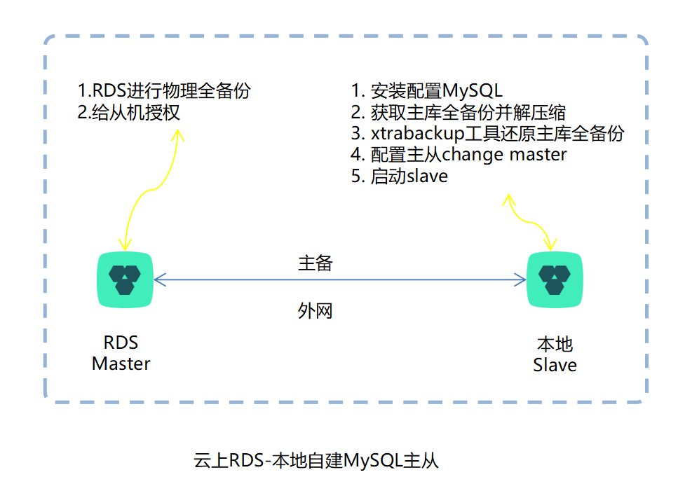

# 云上RDS与本地IDC自建mysql同步方案测试

> 2017-08-17 BoobooWei

[TOC]

## 同步搭建思路

> DTS迁移服务实现云上RDS与本地IDC自建mysql

### 网络的问题？外网或者内网 

* 内网（速度快）需要打通，vpc+vpn（不稳定）或者高速通道（稳定费用贵）来打通
* 外网（速度慢）

### 搭建主从？手动或者DTS

* 手动——1.数据初始化一致（量大物理xtrabackup和量小逻辑）；2.配置主从
* DTS——迁移服务（限制不能执行ddl操作）
* DTS——同步服务（不支持该场景的）

---


## 同步搭建测试

1. DTS迁移功能对ddl的限制（结构迁移和全量迁移中不支持ddl操作；增量迁移中可以）
2. 手动配置的实现细节

### 测试1——DTS迁移服务

#### 测试结果

1. DTS迁移功能可以实现云上到云下的MySQL同步
2. 迁移过程分为：结构化；全量；增量
3. 只要在进入增量迁移后才能执行DDL，否则很有可能导致数据不一致
4. 该功能费用比较贵（1.04/h 1.88/h 3.03/h）

#### 测试过程

* 华东2的rds一台；华东1的ecs一台（eip：121.40.162.80），通过外网做DTS迁移

      

* 将自建mysql所在服务器ip添加至rds白名单

    

* 开通外网地址

  

* RDS中写入数据做测试用

```shell
mysql>CREATE TABLE t1(   
id int primary key auto_increment,    
uname  varchar(20) ,   
ucreatetime  datetime  ,   
age  int(11)) DEFAULT CHARACTER SET=utf8 COLLATE=utf8_general_ci;
执行成功,花费 4 ms.
mysql>delimiter $$
sql分隔符设置为[$$]
mysql>create  procedure test1()  
begin

declare v_cnt decimal (10)  default 0 ;
start transaction;
dd:loop            
        insert  into t1 values         
        (null,'用户1','2010-01-01 00:00:00',20),         
        (null,'用户2','2010-01-01 00:00:00',20),         
        (null,'用户3','2010-01-01 00:00:00',20),         
        (null,'用户4','2010-01-01 00:00:00',20),         
        (null,'用户5','2011-01-01 00:00:00',20),         
        (null,'用户6','2011-01-01 00:00:00',20),         
        (null,'用户7','2011-01-01 00:00:00',20),         
        (null,'用户8','2012-01-01 00:00:00',20),         
        (null,'用户9','2012-01-01 00:00:00',20),         
        (null,'用户0','2012-01-01 00:00:00',20)             
                ;                                        
        set v_cnt = v_cnt+10 ;                            
            if  v_cnt = 1000 then leave dd;                           
            end if;          
        end loop dd ; 
commit;
end;
执行成功,花费 1 ms.
mysql>delimiter ;
sql分隔符设置为[;]
mysql>call test1();
执行成功,花费 9 ms.

mysql>select * from t1 limit 2;
+--------------+-----------------+-----------------------+---------------+
| id           | uname           | ucreatetime           | age           |
+--------------+-----------------+-----------------------+---------------+
|            1 | 用户1           | 2010-01-01 00:00:00   |            20 |
|            2 | 用户2           | 2010-01-01 00:00:00   |            20 |
+--------------+-----------------+-----------------------+---------------+
共返回 2 行记录,花费 1 ms.
mysql>show variables like 'gtid%';
+-------------------------+-----------------+
| Variable_name           | Value           |
+-------------------------+-----------------+
| gtid_executed           |                 |
| gtid_mode               | ON              |
| gtid_next               | AUTOMATIC       |
| gtid_owned              |                 |
| gtid_purged             |                 |
+-------------------------+-----------------+
共返回 5 行记录,花费 1 ms.

mysql>show variables like '%sync%';
+-------------------------------------------+-----------------+
| Variable_name                             | Value           |
+-------------------------------------------+-----------------+
| innodb_sync_array_size                    | 1               |
| innodb_sync_spin_loops                    | 100             |
| rds_rpl_consistency_sync_enabled          | OFF             |
| rpl_semi_sync_master_enabled              | ON              |
| rpl_semi_sync_master_timeout              | 1000            |
| rpl_semi_sync_master_trace_level          | 1               |
| rpl_semi_sync_master_wait_for_slave_count | 1               |
| rpl_semi_sync_master_wait_no_slave        | ON              |
| rpl_semi_sync_master_wait_point           | after_commit    |
| rpl_semi_sync_slave_delay_master          | OFF             |
| rpl_semi_sync_slave_enabled               | OFF             |
| rpl_semi_sync_slave_kill_conn_timeout     | 5               |
| rpl_semi_sync_slave_trace_level           | 1               |
| sync_binlog                               | 1               |
| sync_frm                                  | ON              |
| sync_master_info                          | 10000           |
| sync_relay_log                            | 10000           |
| sync_relay_log_info                       | 10000           |
| tokudb_commit_sync                        | ON              |
| tokudb_fsync_log_period                   | 0               |
+-------------------------------------------+-----------------+
共返回 20 行记录,花费 1 ms.

mysql>show master status\G;
*************************** 1. row ***************************
             File: mysql-bin.000004
         Position: 4197491
     Binlog_Do_DB: 
 Binlog_Ignore_DB: 
Executed_Gtid_Set: 905e45fd-82fb-11e7-ae4e-7cd30abc989e:1-6953
共返回 1 行记录,花费 1 ms.

mysql>show variables like 'server%';
+-------------------------+--------------------------------------+
| Variable_name           | Value                                |
+-------------------------+--------------------------------------+
| server_id               | 1516718431                           |
| server_id_bits          | 32                                   |
| server_uuid             | 905e45fd-82fb-11e7-ae4e-7cd30abc989e |
+-------------------------+--------------------------------------+
共返回 3 行记录,花费 1 ms.
mysql>show variables like 'lower%';
+-------------------------+-----------------+
| Variable_name           | Value           |
+-------------------------+-----------------+
| lower_case_file_system  | OFF             |
| lower_case_table_names  | 1               |
+-------------------------+-----------------+
共返回 2 行记录,花费 9 ms.
```

* 从机安装数据库并配置

```shell
# 安装使用脚本一键执行即可
[root@test mysql]# cat /etc/my.cnf
[client]
port            = 3306
socket          = /tmp/mysql.sock
[mysqld]
port            = 3306
socket          = /tmp/mysql.sock
skip-external-locking
log-error=/alidata/mysql/log/error.log
key_buffer_size = 16M
max_allowed_packet = 1M
table_open_cache = 64
sort_buffer_size = 512K
net_buffer_length = 8K
read_buffer_size = 256K
read_rnd_buffer_size = 512K
myisam_sort_buffer_size = 8M


sql_mode=NO_ENGINE_SUBSTITUTION,STRICT_TRANS_TABLES

# AB replication
server-id=1
log-bin=/alidata/mysql/log-bin/booboo
gtid_mode=on
enforce_gtid_consistency=1
replicate_wild_do_table=zyadmintest.%
replicate_wild_ignore_table=mysql.%
replicate_wild_ignore_table=information_schema.%
replicate_wild_ignore_table=performance_schema.%

# binlog
binlog_format=row  
log-slave-updates=1
expire_logs_days        =  10
max_binlog_size         =  100M

lower_case_table_names=1
skip-name-resolve


[mysqldump]
quick
max_allowed_packet = 16M

[mysql]
no-auto-rehash

[myisamchk]
key_buffer_size = 20M
sort_buffer_size = 20M
read_buffer = 2M
write_buffer = 2M

[mysqlhotcopy]
interactive-timeout
```

* 从机给DTS授权

```shell
mysql> grant all on *.* to 'dtstest'@'%' identified by 'uplooking';
Query OK, 0 rows affected (0.02 sec)

mysql> flush privileges;
Query OK, 0 rows affected (0.03 sec)
```

* 新建DTS迁移任务

  

        

* 不同规格的配置费用不同

        

* 若rds在开启迁移任务后没有增量写入，则会报错，如下图所示。

  

* 若有增量则不会报错，顺利完成迁移任务，并同步到无延迟状态

  

* 若在迁移过程中，已经进入增量迁移，此时在RDS中执行DDL操作，不影响数据一致性

```shell
# RDS
alter table t1 add column new default 0;
alter table t1 add column new2 default 0;
alter table t1 add column new3 default 0;

# slave
mysql>desc t1;
+-----------------+----------------+----------------+---------------+-------------------+-----------------+
| Field           | Type           | Null           | Key           | Default           | Extra           |
+-----------------+----------------+----------------+---------------+-------------------+-----------------+
| id              | int(11)        | NO             | PRI           |                   | auto_increment  |
| uname           | varchar(20)    | YES            |               |                   |                 |
| ucreatetime     | datetime       | YES            |               |                   |                 |
| age             | int(11)        | YES            |               |                   |                 |
| new             | int(11)        | YES            |               | 0                 |                 |
| new2            | int(11)        | YES            |               | 0                 |                 |
| new3            | int(11)        | YES            |               | 0                 |                 |
+-----------------+----------------+----------------+---------------+-------------------+-----------------+
```

* 若在迁移过程中，还在结构迁移或全量迁移中，此时在RDS中执行DDL操作，会影响数据一致性

```shell
# RDS
mysql>desc t1;
+-----------------+----------------+----------------+---------------+-------------------+-----------------+
| Field           | Type           | Null           | Key           | Default           | Extra           |
+-----------------+----------------+----------------+---------------+-------------------+-----------------+
| id              | int(11)        | NO             | PRI           |                   | auto_increment  |
| uname           | varchar(20)    | YES            |               |                   |                 |
| ucreatetime     | datetime       | YES            |               |                   |                 |
| age             | int(11)        | YES            |               |                   |                 |
| new             | int(11)        | YES            |               | 0                 |                 |
| new2            | int(11)        | YES            |               | 0                 |                 |
| new3            | int(11)        | YES            |               | 0                 |                 |
+-----------------+----------------+----------------+---------------+-------------------+-----------------+
共返回 7 行记录,花费 1 ms.
mysql>alter table t1 drop  column new ;
执行成功,花费 162 ms.
mysql>alter table t1 drop  column new2 ;
执行成功,花费 161 ms.
mysql>alter table t1 drop  column new3 ;
执行成功,花费 155 ms.
mysql>call test1();
执行成功,花费 17 ms.

mysql>alter table t1 add column new int default 0;
执行成功,花费 430 ms.
mysql>desc t1;
+-----------------+----------------+----------------+---------------+-------------------+-----------------+
| Field           | Type           | Null           | Key           | Default           | Extra           |
+-----------------+----------------+----------------+---------------+-------------------+-----------------+
| id              | int(11)        | NO             | PRI           |                   | auto_increment  |
| uname           | varchar(20)    | YES            |               |                   |                 |
| ucreatetime     | datetime       | YES            |               |                   |                 |
| age             | int(11)        | YES            |               |                   |                 |
| new             | int(11)        | YES            |               | 0                 |                 |
+-----------------+----------------+----------------+---------------+-------------------+-----------------+
共返回 5 行记录,花费 1 ms.
mysql>insert into t1 set uname='mm',age=10;
共影响 1 行记录,花费 2 ms.
mysql>select * from t1 where uname='mm';
+--------------+-----------------+-----------------------+---------------+---------------+
| id           | uname           | ucreatetime           | age           | new           |
+--------------+-----------------+-----------------------+---------------+---------------+
|       137003 | mm              |                       |            10 |             0 |
+--------------+-----------------+-----------------------+---------------+---------------+
共返回 1 行记录,花费 44 ms.

# slave
mysql> desc t1;
+-------------+-------------+------+-----+---------+----------------+
| Field       | Type        | Null | Key | Default | Extra          |
+-------------+-------------+------+-----+---------+----------------+
| id          | int(11)     | NO   | PRI | NULL    | auto_increment |
| uname       | varchar(20) | YES  |     | NULL    |                |
| ucreatetime | datetime    | YES  |     | NULL    |                |
| age         | int(11)     | YES  |     | NULL    |                |
| new2        | int(11)     | YES  |     | 0       |                |
| new         | int(11)     | YES  |     | 0       |                |
+-------------+-------------+------+-----+---------+----------------+
6 rows in set (0.14 sec)
mysql> select * from t1 where uname='mm';
+--------+-------+-------------+------+------+------+
| id     | uname | ucreatetime | age  | new2 | new  |
+--------+-------+-------------+------+------+------+
| 137003 | mm    | NULL        |   10 |    0 |    0 |
+--------+-------+-------------+------+------+------+
1 row in set (0.07 sec)
```

* 此时发现slave中的表结构与RDS中不同，slave中多了new2列。


---


### 测试2——手动



#### 配置RDS主实例
1. 配置从实例读取数据使用的只读账号和授权数据库
2. 将从实例的IP地址加入主实例的IP白名单
3. 查询主实例的server_id
#### 配置本地MySQL从实例
1. 安装MySQL数据库软件
> 本地安装的版本与RDS For MySQL版本一致即可
2. 修改从MySQL配置文件
 > 根据不同的数据库版本以及客户的需求选择合适的参数，例如是否开启gtid模式，是否开启半同步模式等。
3. RDS物理备份文件恢复到本地MySQL
> RDS Linux 平台使用 wget 工具下载备份与日志文件
> 参考：https://help.aliyun.com/knowledge_detail/41710.html
> 恢复云数据库MySQL的备份文件到自建数据库
> 参考：https://help.aliyun.com/knowledge_detail/41817.html
4. 配置主从
>1. 通过xtrabackup_slave_info文件，获取主库在备份结束时刻RDS当前GTID值
>2. 设置@@GLOBAL.GTID_PURGED变量的值为1中获取的gtid值
>3. 配置同步选项宣告主库的相关信息，执行change master to命令
>4. 启动slave执行start slave
>5. 执行show slave status\G查看同步状态
>6. 至此RDS for MySQL + 本地自建数据库的主从复制配置完成