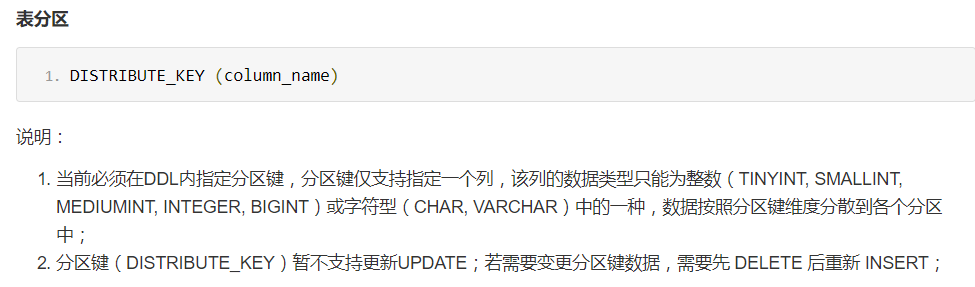

# HybridDB for MySQL (原PetaData)测试

> 20171027 驻云DBA组

[TOC]

## 购买HybirdDB


## 初步管理和设置

> 相对成熟的RDS来说，目前HTAP的管理项目较少。


## SQL操作测试

HybridDB for MySQL 默认使用TokuDB


查看目前所有的库和MySQL的版本 


创建表的DDL语句与MySQL不通，具体需要查看[官方文档](https://help.aliyun.com/document_detail/48678.html?spm=5176.doc26322.6.565.tnwA6S)



通过外网登陆到服务器 


创建测试表t2

```shell
create table t2 (id bigint primary key auto_increment,user char(20),hiredate int) distribute_key (hiredate);
# 分区间不能使用日期类的数据，所以此处用int类型
```

插入一些数据： 
```shell
[root@ToBeRoot ~]# cat foo.sh 
#!/bin/bash
for i in `seq 1 10000000` 
do
	echo "insert into t2 (user,hiredate) values ('user${i}',$((1509090554+$i)));" >> htap.sql
done

[root@ToBeRoot ~]# bash foo.sh
[root@ToBeRoot ~]# mysql -u zyadmin -pUploo00king -hpub-m-bp1d1b614a1911a4.petadata.rds.aliyuncs.com -P 3306 booboo_test< htap.sql 
mysql: [Warning] Using a password on the command line interface can be insecure.

mysql> select count(*) from t2 where hiredate between unix_timestamp("2017-10-27 15:50:04") and unix_timestamp("2017-10-27 15:59:00");
+----------+
| COUNT(*) |
+----------+
|      537 |
+----------+
1 row in set (0.14 sec)
```

查看测试表t2的具体情况 

 

测试查询语句


```shell
mysql> explain select count(*) from t2 where hiredate between unix_timestamp("2017-10-27 15:50:04") and unix_timestamp("2017-10-27 15:59:00");
+-------+-------------+---------------------------------------------------------------------------------------------------------------------------------+
| Index | Partition   | Info                                                                                                                            |
+-------+-------------+---------------------------------------------------------------------------------------------------------------------------------+
|     0 | BOOBOO_TEST | Merge for Analysis: Merge Data;                                                                                                 |
|     1 | BOOBOO_TEST |  select count(*) from t2 where hiredate between unix_timestamp("2017-10-27 15:50:04") and unix_timestamp("2017-10-27 15:59:00") |
|     2 | BOOBOO_TEST |  select count(*) from t2 where hiredate between unix_timestamp("2017-10-27 15:50:04") and unix_timestamp("2017-10-27 15:59:00") |
|     3 | BOOBOO_TEST |  select count(*) from t2 where hiredate between unix_timestamp("2017-10-27 15:50:04") and unix_timestamp("2017-10-27 15:59:00") |
|     4 | BOOBOO_TEST |  select count(*) from t2 where hiredate between unix_timestamp("2017-10-27 15:50:04") and unix_timestamp("2017-10-27 15:59:00") |
+-------+-------------+---------------------------------------------------------------------------------------------------------------------------------+
5 rows in set (0.01 sec)

```

