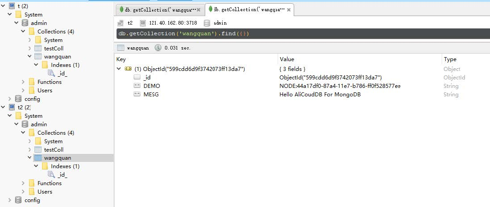
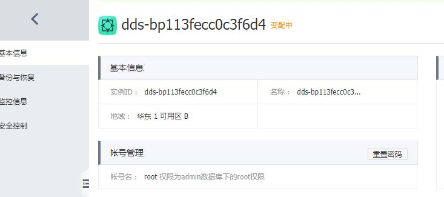
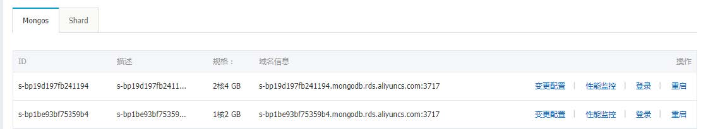
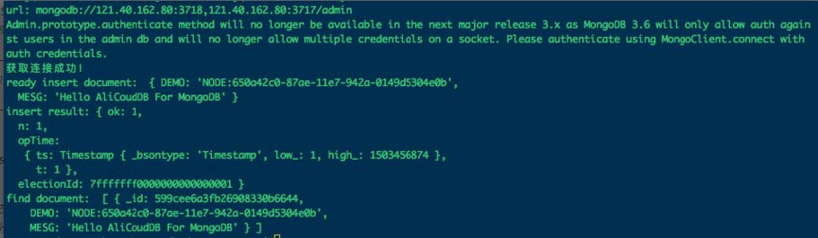
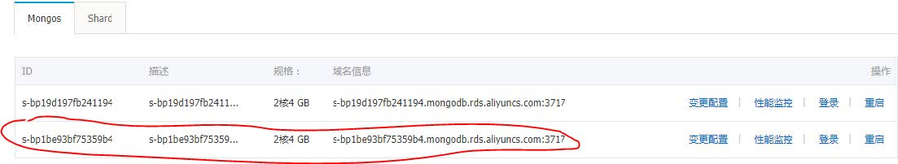
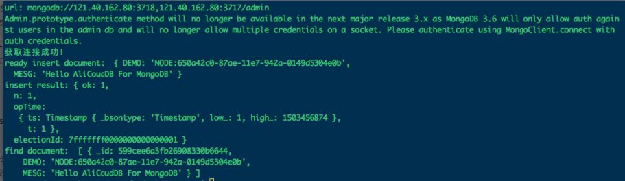
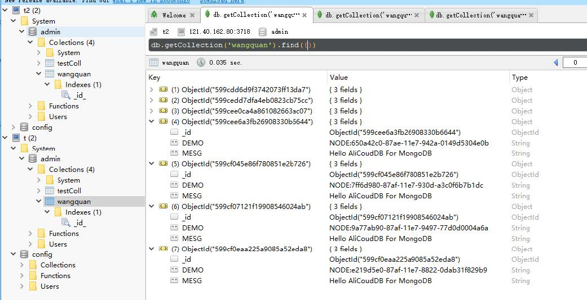

# AliYun mongodb 分片集群程序代码连接

[TOC]

##安装驱动包以及工具包

```shell
npm install mongodb node‐uuid sprintf‐js –save
```

## node.js

```
'use strict';
var uuid = require('node‐uuid');
var sprintf = require("sprintf‐js").sprintf;
var mongoClient = require('mongodb').MongoClient;
var host1 = "121.40.162.80";
var port1 = 3718;
var host2 = "121.40.162.80";
var port2 = 3717;
var username = "root";
var password = "Zhuyun@123";
var replSetName = "mgset‐1441984991";
var demoDb = "admin";
var demoColl = "testColl";
// 121.40.162.80 3718 s‐bp19d197fb241194.mongodb.rds.aliyuncs.com 3717
// 121.40.162.80 3717 s‐bp1be93bf75359b4.mongodb.rds.aliyuncs.com 3717
// 官方建议使用的方案
var url = sprintf("mongodb://%s:%d,%s:%d/%s", host1, port1, host2, port2, demoDb);
'use strict';
console.info("url:", url);
// 获取mongoClient
mongoClient.connect(url, function(err, db) {
if(err) {
console.error("connect err:", err);
return 1;
}
// 授权. 这里的username基于admin数据库授权
var adminDb = db.admin();
adminDb.authenticate(username, password, function(err, result) {
if(err) {
console.error("authenticate err:", err);
return 1;
}
// 取得Collecton句柄
var collection = db.collection(demoColl);
console.info("获取连接成功！");
var demoName = "NODE:" + uuid.v1();
var doc = {"DEMO": demoName, "MESG": "Hello AliCoudDB For MongoDB"};
console.info("ready insert document: ", doc);
// 插入数据
collection.insertOne(doc, function(err, data) {
if(err) {
console.error("insert err:", err);
return 1;
}
console.info("insert result:", data["result"]);
// 读取数据
var filter = {"DEMO": demoName};
collection.find(filter).toArray(function(err, items) {
if(err) {
console.error("find err:", err);
return 1;
返回记录
客户端查看
}
console.info("find document: ", items);
//关闭Client，释放资源
db.close();
```

## 返回记录

```shell
url: mongodb://121.40.162.80:3718,121.40.162.80:3717/admin
Admin.prototype.authenticate method will no longer be available in the next major release 3.x as
MongoDB 3.6 will only allow auth against users in the admin db and will no longer allow multiple
credentials on a socket. Please authenticate using MongoClient.connect with auth credentials.
获取连接成功！
ready insert document: { DEMO: 'NODE:44a17df0‐87a4‐11e7‐b786‐ff0f528577ee',
MESG: 'Hello AliCoudDB For MongoDB' }
insert result: { ok: 1,
n: 1,
opTime:
{ ts: Timestamp { _bsontype: 'Timestamp', low_: 2, high_: 1503452524 },
t: 1 },
electionId: 7fffffff0000000000000001 }
find document: [ { _id: 599cdd6d9f3742073ff13da7,
DEMO: 'NODE:44a17df0‐87a4‐11e7‐b786‐ff0f528577ee',
MESG: 'Hello AliCoudDB For MongoDB' } ]
```

## 客户端查看



## 双节点连接升级mongos






## 测试程序




> 程序可以正常运行。

## 程序连接单节点测试

连接节点部分改为以下内容

```shell
var host2 = "121.40.162.80";
var port2 = 3717;
var url = sprintf("mongodb://%s:%d/%s",host2, port2, demoDb);
```

## 只升级s-bp1be93bf75359b4



## 测试程序



## 结果查看



节点升级，程序运行正常，正常读写操作。