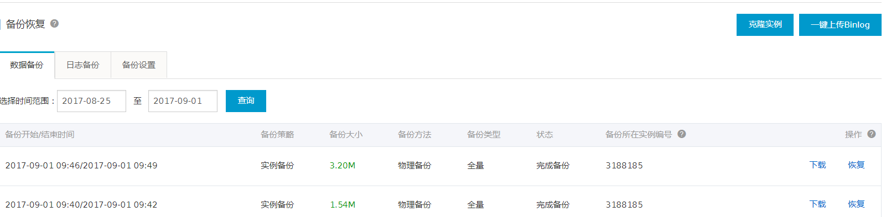
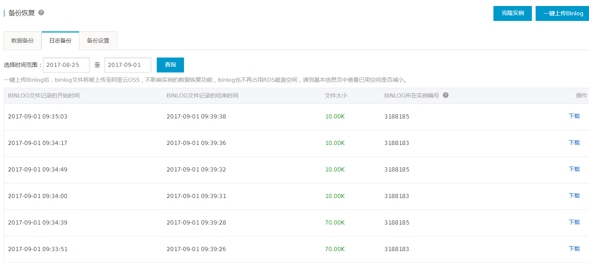
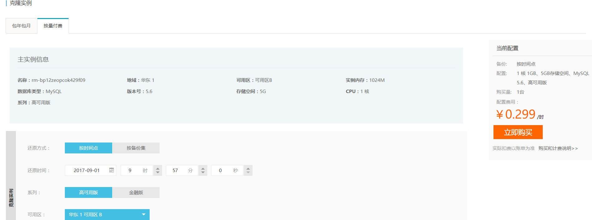
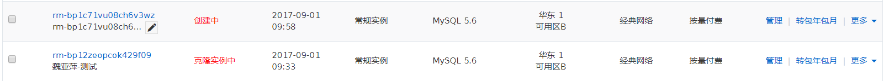

# RDS 克隆实例测试

> 2017-09-01 测试验证：RDS是否可以回滚到任何时间点？

## 测试概览

| 时间点                 | 动作                                  |
| ------------------- | ----------------------------------- |
| 2017-09-01 09:43:51 | 表中插入10万行测试数据                        |
| 2017-09-01 09:49:00 | 全备份结束时间点                            |
| 2017-09-01 09:52:11 | 插入一行新数据，表中一共100001行数据               |
| 2017-09-01 09:57:00 | 控制台看到最新binlog日志时间为09:35:03~09:39:38 |
| 2017-09-01 09:57:30 | 通过克隆实例选择要恢复的时间点为2017-09-01 09:57:00 |
| 2017-09-01 10:18:00 | 将源库表中执行delete操作，删除所有的数据             |
| 2017-09-01 10:25:00 | 克隆实例成功恢复到时间点为2017-09-01 09:57:00的状态 |

## 测试内容

观察克隆实例最终的数据是否是恢复到100001条


## 测试详细过程

* 全备份的时间点为2017-09-01 09:46:00~09:49:00 



```shell
# 2017-09-01 09:50:00  
mysql>select count(*) from t1;
+--------------------+
| count(*)           |
+--------------------+
| 100000             |
+--------------------+
共返回 1 行记录,花费 17 ms.
```

* 09:49全备份结束的时间点数据一共有10万条

* 09:52:11 插入新的数据，表中一共有11万条

```shell
# 2017-09-01 09:52:11
mysql>insert into t1 values (null,'zy',sysdate(),4);
共影响 1 行记录,花费 6 ms.
mysql>select count(*) from t1;
+--------------------+
| count(*)           |
+--------------------+
| 100001             |
+--------------------+
共返回 1 行记录,花费 20 ms.
mysql>select * from t1 where id=100001;
+--------------+-----------------+-----------------------+---------------+
| id           | uname           | ucreatetime           | age           |
+--------------+-----------------+-----------------------+---------------+
|       100001 | zy              | 2017-09-01 09:52:11   |             4 |
+--------------+-----------------+-----------------------+---------------+
共返回 1 行记录,花费 2 ms.
```

* 2017-09-01 09:57:00 从控制台看到最新binlog日志时间为09:35:03~09:39:38



* 点击可克隆实例，选择要恢复的时间点为2017-09-01 09:57:00



* 删除源库中的所有数据

```shell
mysql>delete from t1 ;
共影响 100001 行记录,花费 266 ms.
警告：展示记录达到最大返回行数！
mysql>select count(*) from t1;
+--------------------+
| count(*)           |
+--------------------+
| 0                  |
+--------------------+
共返回 1 行记录,花费 2 ms.
```

* 等待克隆实例的完成



* 克隆实例数据的情况

```shell
mysql>select count(*) from t1;
+--------------------+
| count(*)           |
+--------------------+
| 100001             |
+--------------------+
共返回 1 行记录,花费 129 ms.
```

## 总结

> **可以实现任意时间点，但是有前提条件**

### 克隆实例的原理

​	A----------------->B------------->C

​	写数据---------z>全备--------->克隆实例恢复时间点

---

* 获取距离指定恢复时间点C最近的时间点B的全备份数据,导入克隆实例
* 获取全备份数据时间点B后到克隆实例时间点C之间的binlog日志,重演日志

### 恢复“任意时间点”的前提条件

* 全备份文件存在
* 时间点B到C之间的所有binlog日志都存在


### 备份和binlog日志的限制

>实例的备份文件会占用备份空间，每个RDS实例的备份空间都有一定量的免费额度，超出免费额度的备份空间使用量将会产生额外的费用。关于备份空间使用量的收费标准，请参见云数据库RDS详细价格信息。不同类型实例的备份空间免费额度不同。

### 备份空间免费额度的计算公式

>当您的数据备份量（OSS+OAS）和 日志备份量（OSS）的总量小于等于50%*实例购买的存储空间时，都在免费额度内。

### 备份空间费用信息

> 计费量＝数据备份量（OSS＋OAS）＋日志备份量（OSS）－ 50%*实例购买的存储空间（单位为 GB，只入不舍），价格为 0.001 元/GB/小时。

**目前正在跟阿里工单确认：如果用户超过免费额度后没有购买，阿里是否会清除备份数据（binlog和备份）数据。**

> 阿里工单回复如下：

> **是不会删除客户的的备份的，如还您免费空间使用完了不想付费，数据库会被锁定导致客户无法正常使用的。**

### 关于恢复时间问题

从测试来看恢复的时间并不可控，测试中的数据一共才3.2M，恢复成功耗时接近30分钟。

## 官方文档参考

[备份空间免费额度](https://help.aliyun.com/document_detail/55607.html?spm=5176.7741872.6.705.VmFtdx)
[克隆实例](https://help.aliyun.com/document_detail/44088.html?spm=5176.doc26208.6.707.Yooh24)

[备份数据](https://help.aliyun.com/document_detail/26206.html)

