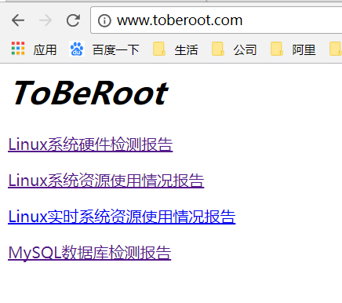
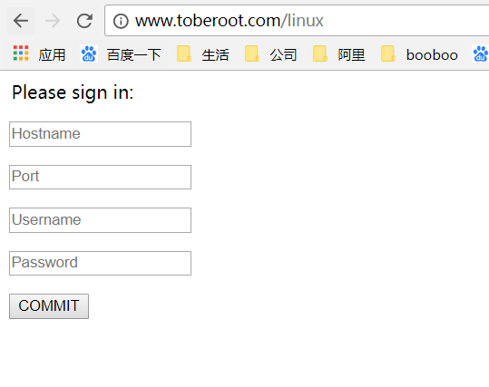
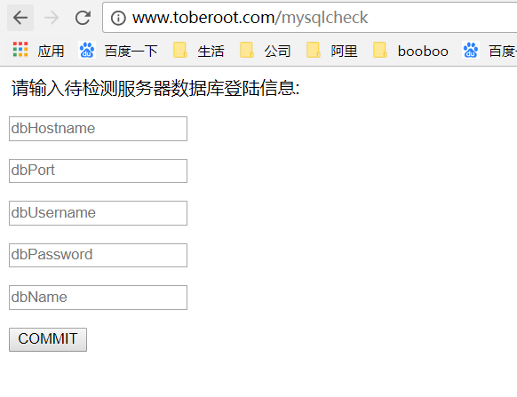
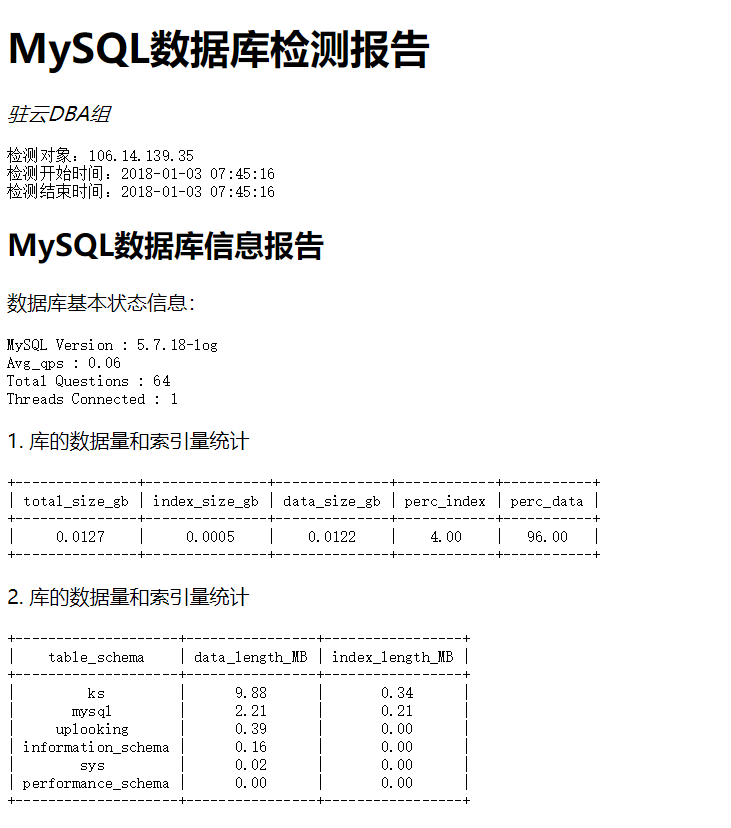

# MySQL APP

> 2018-01-03 Booboo

[TOC]

## 功能介绍

> 详细报告参见[report](python/web_ops/report)

* Linux实时系统资源使用情况
* Linux系统硬件检测报告
* Linux系统资源历史使用情况
* MySQL数据库检测报告

## 服务搭建

> 示范：CentOS6.8_Nginx_python2.7__gunicorn

### python代码部署

```shell
# python代码部署位置 /var/www/mysql/app
[root@ToBeRoot mysqlapp]# ll
total 104
-rwxr-xr-x 1 apache apache  2802 Jan  3 14:07 app.py
-rw-r--r-- 1 root   root    3599 Jan  3 15:13 app.pyc
-rwxr-xr-x 1 apache apache 35282 Jan  3 11:29 get_mysql_tuning.py
-rw-r--r-- 1 root   root   28958 Jan  3 15:13 get_mysql_tuning.pyc
-rwxr-xr-x 1 apache apache  3634 Jan  3 13:46 get_os_info.py
-rw-r--r-- 1 root   root    4220 Jan  3 15:13 get_os_info.pyc
-rw-r--r-- 1 root   root       0 Jan  3 13:43 __init__.py
-rwxr-xr-x 1 apache apache  3125 Jan  3 11:29 mysqlcon.py
-rw-r--r-- 1 root   root    3526 Jan  3 15:13 mysqlcon.pyc
drwxr-xr-x 2 apache apache  4096 Jan  3 10:05 pic
drwxr-xr-x 2 apache apache  4096 Jan  3 14:05 templates
```

### python第三方包

```shell
pip install setuptools
pip install flask
pip install paramiko
pip install prettytable
pip install MySQLdb
pip install gunicorn
```

### Nginx软件安装

```shell
yum install -y nginx
```

### Nginx配置反向代理

```shell
server {

    listen 80;
    server_name  www.toberoot.com;
    location / {
        proxy_set_header Host $host;
        proxy_set_header X-Real-Ip $remote_addr;
        proxy_set_header X-Forwarded-For $remote_addr;
        proxy_pass http://127.0.0.1:5000;
    }

    error_page 404 /404.html;
        location = /40x.html {
    }

    error_page 500 502 503 504 /50x.html;
        location = /50x.html {
```

###  gunicorn启动应用

```shell
gunicorn app:app --bind 0.0.0.0:5000 --daemon
```

### Nginx启动服务

```shell
service nginx start
```

## 测试访问










