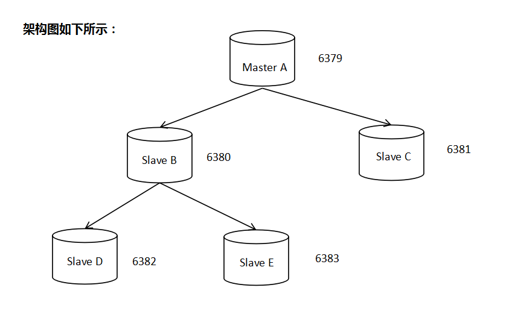
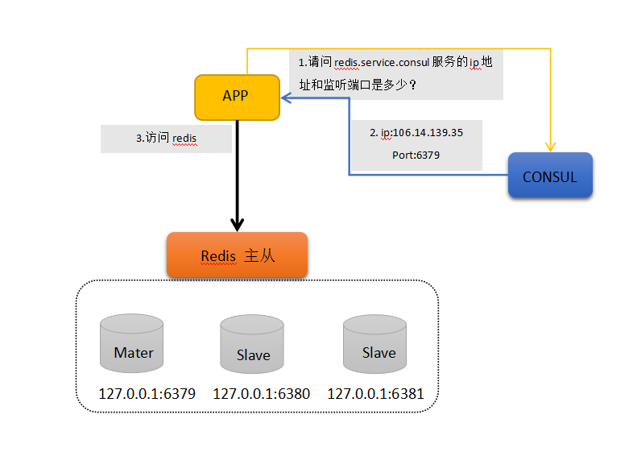

# Redis 主从

[TOC]


## Redis主从简介

Redis可以通过**持久化方式**，将数据保存在硬盘上，防止数据丢失，但这样仍然存在一些问题，比如**单点故障**，当redis主机发生宕机，会严重影响到服务。比较常见的做法是使用多台主机来运行Redis，并且通过数据同步实现其一致性。我们将此环境称之为**Redis主从**。

redis 使用异步复制；

Redis主从分为master（主）与slave（从）；

一般情况下，主服务器可以读写，从机只读，主服务器会将所有写操作同步给slave；

一个主服务器可以拥有多个slave；

一个slave只能有一个master；

一个slave也能拥有多个slave；

Redis的主从结构可以采用一主多从或者级联结构，下图为级联结构。

 

 

## Redis 主从的原理

 **主从同步=全量同步+增量同步**

【**全量同步**】从服务器启用时，会向主服务器发送sync指令。此时，主服务器会立刻执行RDB快照备份，并将备份过程中收到的命令缓冲下来。RDB备份完成后，将备份文件与缓冲命令一起传输给从机，从机加载备份文件并执行缓冲命令，实现数据一致。这个过程称为复制初始化。

【**增量同步**】自此以后主服务器执行的所有命令都将以异步方式传输到从机。

 

|      |                                          |
| ---- | ---------------------------------------- |
|      |  |

 

 

### 全量同步

**Redis全量复制一般发生在Slave初始化阶段，这时Slave需要将Master上的所有数据都复制一份。具体步骤如下： 

　　1）从服务器连接主服务器，发送SYNC命令； 
　　2）主服务器接收到SYNC命名后，开始执行BGSAVE命令生成RDB文件并使用缓冲区记录此后执行的所有写命令； 
　　3）主服务器BGSAVE执行完后，向所有从服务器发送快照文件，并在发送期间继续记录被执行的写命令； 
　　4）从服务器收到快照文件后丢弃所有旧数据，载入收到的快照； 
　　5）主服务器快照发送完毕后开始向从服务器发送缓冲区中的写命令； 
　　6）从服务器完成对快照的载入，开始接收命令请求，并执行来自主服务器缓冲区的写命令；

完成上面几个步骤后就完成了从服务器数据初始化的所有操作，从服务器此时可以接收来自用户的读请求。

### 增量同步

Redis增量复制是指Slave初始化后开始正常工作时主服务器发生的写操作同步到从服务器的过程。 增量复制的过程主要是主服务器每执行一个写命令就会向从服务器发送相同的写命令，从服务器接收并执行收到的写命令。

### 主从同步策略

主从刚刚连接的时候，进行全量同步；全同步结束后，进行增量同步。当然，如果有需要，slave 在任何时候都可以发起全量同步。redis 策略是，无论如何，首先会尝试进行增量同步，如不成功，要求从机进行全量同步。

## 相关参数

 ```shell
slaveof masterip msaterport
slave-read-only
 ```


主从同步的作用不单单是为了提高可用性，同时也可以通过**负载均衡和读写分离**来提升性能。另外有一个和性能相关的建议，**如果你需要搭建一个主从环境，那你可以考虑在主服务器上停用RDB备份，只在从机上启用即可。RDB备份是一种比较消耗性能的操作，这样我们可以相对节约主服务器性能消耗。**不过就算你关闭了RDB备份，但是在执行复制初始化过程中，乃会创建一个RDB文件，此时你可以通过以下参数开启**redis无硬盘复制模式**。此模式一但开启，主服务器会将RDB备份文件直接传输给从机，而不会保存到硬盘上。

 ```shell
repl-diskless-sync yes
 ```

## 添加密码认证

master 参数

```shell
# 1. 修改配置，并重启
requirepass zy123456
# 2. 通过命令行进行配置，无需重启，当前生效，重启失效
> config set requirepass zy123456  
OK  
> config get requirepass  
1) "requirepass"  
2) "my_redis"

# 登陆方式1. 带密码参数登陆
redis-cli -a zy123456
# 登陆方式2. 交互式命令登陆
> auth zy123456
```


slave 参数

```shell
# 1. 修改配置文件
masterauth  zy123456
# 2. 通过命令行进行配置，无需重启，当前生效，重启失效
> config set masterauth zy123456
```

此时访问master需要密码，访问slave不需要密码。

## 配置主从

**Ex：配置主从（master:mastera0 ip:172.25.0.10 , slave:slave0 ip:172.25.0.12）**

```shell
# 登录master redis : mastera0，将监听ip改为网卡ip，以便与slave通信
[root@mastera0 ~]# vi /etc/redis.conf
bind 172.25.0.11 127.0.0.1
[root@mastera0 ~]# systemctl  restart redis

# 物理机上启动slavea虚拟机 并登录
[kiosk@foundation0 materials]$ rht-vmctl  start slavea
[kiosk@foundation0 materials]$ ssh root@slavea0

# 初始化slave虚拟机环境(安装源，防火墙，selinux)
[root@slavea0 ~]# yum install wget -y
[root@slavea0 ~]# cd /etc/yum.repos.d/
[root@slavea0 yum.repos.d]# wget http://172.25.254.254/content/courses/db100/rhel7.2/materials/redis.repo
[root@slavea0 yum.repos.d]#yum makecache
[root@slavea0 yum.repos.d]#yum install redis -y
[root@slavea0 yum.repos.d]# systemctl  stop firewalld
[root@slavea0 yum.repos.d]# systemctl  disable firewalld
Removed symlink /etc/systemd/system/dbus-org.fedoraproject.FirewallD1.service.
Removed symlink /etc/systemd/system/basic.target.wants/firewalld.service.

[root@mastera0 ~]# setenforce 0

# 初始化slave虚拟机环境(安装源，防火墙，selinux)
[root@slavea0 ~]# vi /etc/redis.conf
bind 172.25.0.13 127.0.0.1
slaveof 172.25.0.11 6379
[root@slavea0 ~]# systemctl  restart redis

# 切换至master redis : mastera0 ，创建测试数据test
[root@mastera0 ~]# redis-cli  -h 127.0.0.1
127.0.0.1:6379> set test replication
OK
127.0.0.1:6379> get test
"replication"

# 切换至slave redis : slavea0 ，验证主从结果
[root@slavea0 ~]# redis-cli  -h 127.0.0.1
127.0.0.1:6379> get test
"replication"
```


# 官方sentinel做redis高可用方案

关于Redis高可用方案，看到较多的是keepalived、zookeeper方案。 keepalived是主备模式，意味着总有一台浪费着。zookeeper工作量成本偏高。 本文主要介绍下使用官方sentinel做redis高可用方案的设计。

## Redis Sentinel

### Sentinel介绍

Sentinel是Redis官方为集群提供的高可用解决方案。 在实际项目中可以使用sentinel去做redis自动故障转移，减少人工介入的工作量。另外sentinel也给客户端提供了监控消息的通知，这样客户端就可根据消息类型去判断服务器的状态，去做对应的适配操作。

下面是Sentinel主要功能列表：

· Monitoring：Sentinel持续检查集群中的master、slave状态，判断是否存活。

· Notification：在发现某个redis实例死的情况下，Sentinel能通过API通知系统管理员或其他程序脚本。

· Automatic failover：如果一个master挂掉后，sentinel立马启动故障转移，把某个slave提升为master。其他的slave重新配置指向新master。

· Configuration provider：对于客户端来说sentinel通知是有效可信赖的。客户端会连接sentinel去请求当前master的地址，一旦发生故障sentinel会提供新地址给客户端。

### Sentinel配置

Sentinel本质上只是一个运行在特殊模式下的redis服务器，通过不同配置来区分提供服务。 

**sentinel.conf配置：**

```shell
sentinel monitor mymaster 127.0.0.1 6379 2
sentinel down-after-milliseconds mymaster 60000
sentinel failover-timeout mymaster 180000
sentinel parallel-syncs mymaster 1
```
*以上四个参数的含义******

```shell
- [监控名称][ip] [port][多少sentinel同意才发生故障转移]
- [监控名称] [Master多少毫秒后不回应ping命令，就认为master是主观下线状态]
- [故障转移超时时间]
- [在执行故障转移时,最多可以有多少个从服务器同时对新的主服务器进行同步]
```


**sentinel需要使用redis2.8版本以上，启动如下：**

```shell
redis-sentinel sentinel.conf
```

**启动后Sentinel会:**

· 以10秒一次的频率，向被监视的master发送info命令，根据回复获取master当前信息。

· 以1秒一次的频率，向所有redis服务器、包含sentinel在内发送PING命令，通过回复判断服务器是否在线。

· 以2秒一次的频率，通过向所有被监视的master，slave服务器发送包含当前sentinel，master信息的消息。

另外建议sentinel至少起3个实例以上，并配置2个实例同意即可发生转移。 5个实例，配置3个实例同意以此类推。


## 搭建步骤




**测试环境：**

ESCS 1核 1G 32位 CentOS 6.8

**1. 编译安装**

 ```shell
[root@ToBeRoot opt]# echo 1 > /proc/sys/vm/overcommit_memory 
[root@ToBeRoot opt]# sysctl -p  
[root@ToBeRoot opt]# tar -xf redis-3.2.9.tar.gz -C /usr/local/
[root@ToBeRoot opt]# ll /usr/local/redis-3.2.9/
total 208
-rw-rw-r--  1 root root 87407 May 17 23:39 00-RELEASENOTES
-rw-rw-r--  1 root root    53 May 17 23:39 BUGS
-rw-rw-r--  1 root root  1805 May 17 23:39 CONTRIBUTING
-rw-rw-r--  1 root root  1487 May 17 23:39 COPYING
drwxrwxr-x  7 root root  4096 May 17 23:39 deps
-rw-rw-r--  1 root root    11 May 17 23:39 INSTALL
-rw-rw-r--  1 root root   151 May 17 23:39 Makefile
-rw-rw-r--  1 root root  4223 May 17 23:39 MANIFESTO
-rw-rw-r--  1 root root  6834 May 17 23:39 README.md
-rw-rw-r--  1 root root 46695 May 17 23:39 redis.conf
-rwxrwxr-x  1 root root   271 May 17 23:39 runtest
-rwxrwxr-x  1 root root   280 May 17 23:39 runtest-cluster
-rwxrwxr-x  1 root root   281 May 17 23:39 runtest-sentinel
-rw-rw-r--  1 root root  7606 May 17 23:39 sentinel.conf
drwxrwxr-x  2 root root  4096 May 17 23:39 src
drwxrwxr-x 10 root root  4096 May 17 23:39 tests
drwxrwxr-x  7 root root  4096 May 17 23:39 utils
[root@ToBeRoot opt]# cd /usr/local/redis-3.2.9
[root@ToBeRoot redis-3.2.9]# make
[root@ToBeRoot redis-3.2.9]# make
[root@ToBeRoot redis-3.2.9]# ls src/redis*
src/redisassert.h      src/redis-benchmark.o  src/redis-check-aof.o  src/redis-check-rdb.o  src/redis-cli.o     src/redis-trib.rb
src/redis-benchmark    src/redis-check-aof    src/redis-check-rdb    src/redis-cli          src/redis-sentinel
src/redis-benchmark.c  src/redis-check-aof.c  src/redis-check-rdb.c  src/redis-cli.c        src/redis-server

# 优化redis路径和命令路径
[root@ToBeRoot redis-3.2.9]# vim /etc/bashrc
export REDIS_HOME='/usr/local/redis-3.2.9'
export PATH=${PATH}:${REDIS_HOME}/src
[root@ToBeRoot redis-3.2.9]# source /etc/bashrc
[root@ToBeRoot redis-3.2.9]# which redis-server
/usr/local/bin/redis-server
 ```


**2. 建立5个实例，分配目录和配置文件**

```shell
[root@ToBeRoot shellscripts]# cat autoconfig.sh 
#!/bin/bash
#Usage: auto_config.sh 起始端口 实例总数
#example: auto-config.sh 6379 100
REDIS_HOME=/usr/local/redis-3.2.9
mkdir /data/redis -p
cd /data/redis
mkdir conf data log pid


for i in `seq $1 $(($1+$2-1))`
do
mkdir data/$i
grep -v '^#\|^$' $REDIS_HOME/redis.conf > /data/redis/conf/redis${i}.conf
sed -i 's/appendonly no/appendonly yes/' /data/redis/conf/redis${i}.conf
sed -i "s/port.*/port $i/" /data/redis/conf/redis${i}.conf
sed -i "s@dir.*@dir \/data\/redis\/data\/${i}@" /data/redis/conf/redis${i}.conf 
sed -i "s@pid.*@pidfile \/data\/redis\/pid\/redis${i}.pid@" /data/redis/conf/redis${i}.conf
sed -i "s@logfile.*@logfile \/data\/redis\/log\/redis${i}.log@" /data/redis/conf/redis${i}.conf
done
[root@ToBeRoot shellscripts]# cat autoslaveconfig.sh 
#!/bin/bash
#Usage: auto_config.sh 起始端口 实例总数 masterip masterport
#example: auto-config.sh 6379 100 127.0.0.1 6379
REDIS_HOME=/usr/local/redis-3.2.9
mkdir /data/redis -p
cd /data/redis
mkdir conf data log pid
masterip=$3
masterport=$4

for i in `seq $1 $(($1+$2-1))`
do
mkdir data/$i
grep -v '^#\|^$' $REDIS_HOME/redis.conf > /data/redis/conf/redis${i}.conf
sed -i 's/appendonly no/appendonly yes/' /data/redis/conf/redis${i}.conf
sed -i "s/port.*/port $i/" /data/redis/conf/redis${i}.conf
sed -i "s@dir.*@dir \/data\/redis\/data\/${i}@" /data/redis/conf/redis${i}.conf 
sed -i "s@pid.*@pidfile \/data\/redis\/pid\/redis${i}.pid@" /data/redis/conf/redis${i}.conf
sed -i "s@logfile.*@logfile \/data\/redis\/log\/redis${i}.log@" /data/redis/conf/redis${i}.conf
sed -i "21islaveof ${masterip} ${masterport}" /data/redis/conf/redis${i}.conf
done

[root@ToBeRoot shellscripts]# bash autoconfig.sh 6379 1
[root@ToBeRoot shellscripts]# ll /data/redis/conf
total 4
-rw-r--r-- 1 root root 1223 Jul  4 20:01 redis6379.conf
[root@ToBeRoot shellscripts]# ll /data/redis/data/
total 4
drwxr-xr-x 2 root root 4096 Jul  4 20:01 6379
[root@ToBeRoot shellscripts]# ll /data/redis/log
total 0
[root@ToBeRoot shellscripts]# ll /data/redis/pid
total 0
 
[root@ToBeRoot shellscripts]# bash autoslaveconfig.sh 6380 2 127.0.0.1 6379
mkdir: cannot create directory `conf': File exists
mkdir: cannot create directory `data': File exists
mkdir: cannot create directory `log': File exists
mkdir: cannot create directory `pid': File exists
[root@ToBeRoot shellscripts]# bash autoslaveconfig.sh 6382 2 127.0.0.1 6380
mkdir: cannot create directory `conf': File exists
mkdir: cannot create directory `data': File exists
mkdir: cannot create directory `log': File exists
mkdir: cannot create directory `pid': File exists
[root@ToBeRoot shellscripts]# ll /data/redis/conf
total 20
-rw-r--r-- 1 root root 1223 Jul  4 20:01 redis6379.conf
-rw-r--r-- 1 root root 1292 Jul  4 20:02 redis6380.conf
-rw-r--r-- 1 root root 1292 Jul  4 20:02 redis6381.conf
-rw-r--r-- 1 root root 1292 Jul  4 20:02 redis6382.conf
-rw-r--r-- 1 root root 1292 Jul  4 20:02 redis6383.conf
[root@ToBeRoot shellscripts]# ll /data/redis/data/
total 20
drwxr-xr-x 2 root root 4096 Jul  4 20:01 6379
drwxr-xr-x 2 root root 4096 Jul  4 20:02 6380
drwxr-xr-x 2 root root 4096 Jul  4 20:02 6381
drwxr-xr-x 2 root root 4096 Jul  4 20:02 6382
drwxr-xr-x 2 root root 4096 Jul  4 20:02 6383
```


**3. 确认主从架构修改配置文件**

 ```shell
[root@ToBeRoot shellscripts]# ll /data/redis/conf
total 20
-rw-r--r-- 1 root root 1223 Jul  4 20:11 redis6379.conf
-rw-r--r-- 1 root root 1246 Jul  4 20:14 redis6380.conf
-rw-r--r-- 1 root root 1246 Jul  4 20:14 redis6381.conf
-rw-r--r-- 1 root root 1246 Jul  4 20:15 redis6382.conf
-rw-r--r-- 1 root root 1246 Jul  4 20:15 redis6383.conf
[root@ToBeRoot shellscripts]# ll /data/redis/data
total 20
drwxr-xr-x 2 root root 4096 Jul  4 20:11 6379
drwxr-xr-x 2 root root 4096 Jul  4 20:14 6380
drwxr-xr-x 2 root root 4096 Jul  4 20:14 6381
drwxr-xr-x 2 root root 4096 Jul  4 20:15 6382
drwxr-xr-x 2 root root 4096 Jul  4 20:15 6383
[root@ToBeRoot shellscripts]# cd /data/redis/conf
[root@ToBeRoot conf]# vim redis6379.conf 
[root@ToBeRoot conf]# vim redis6380.conf 
[root@ToBeRoot conf]# vim redis6381.conf 
[root@ToBeRoot conf]# vim redis6382.conf 
[root@ToBeRoot conf]# grep slaveof redis6380.conf 
slaveof 127.0.0.1 6379
[root@ToBeRoot conf]# grep slaveof redis6381.conf 
slaveof 127.0.0.1 6379
[root@ToBeRoot conf]# grep slaveof redis6382.conf 
slaveof 127.0.0.1 6380
[root@ToBeRoot conf]# grep slaveof redis6383.conf 
slaveof 127.0.0.1 6380
 ```


**4. 启动redis实例**

```shell
[root@ToBeRoot shellscripts]# cat redisctlnew.sh 
#!/bin/bash
#Usage: redisctl start|stop|status


# 同时启动多实例
start_redis(){
for i in `seq 6379 6383`
do /usr/local/redis-3.2.9/src/redis-server /data/redis/conf/redis${i}.conf &
done
}

# 查看所有实例的守护进程
status_redis(){
count=`ps -ef|grep "redis-server" | grep -v 'grep'|wc -l`
if [ $count == 5 ] ;then echo redis server is running ;else echo redis server is not running;fi
}

# 停止所有实例
stop_redis(){
for i in `ps -ef|grep "redis-server" | grep -v 'grep' | awk '{print $2}'`
do
	kill -9 $i
done
}

case $1 in
start)
	start_redis;;
status)
	status_redis;;
stop)
	stop_redis;;
restart)
	stop_redis;
	start_redis;;
*)
	echo "Usage: redisctl start|stop|status|restart"
Esac

[root@ToBeRoot shellscripts]# chmod a+x redisctlnew.sh 
redis server is not running
[root@ToBeRoot shellscripts]# ps -ef|grep redis
root      5868     1  0 20:23 pts/0    00:00:00 /usr/local/redis-3.2.9/src/redis-server 127.0.0.1:6379                 
root      5869     1  0 20:23 pts/0    00:00:00 /usr/local/redis-3.2.9/src/redis-server 127.0.0.1:6380                 
root      5870     1  0 20:23 pts/0    00:00:00 /usr/local/redis-3.2.9/src/redis-server 127.0.0.1:6381                 
root      5871     1  0 20:23 pts/0    00:00:00 /usr/local/redis-3.2.9/src/redis-server 127.0.0.1:6382                 
root      5872     1  0 20:23 pts/0    00:00:00 /usr/local/redis-3.2.9/src/redis-server 127.0.0.1:6383                 
root      5897  2130  0 20:23 pts/0    00:00:00 grep redis
[root@ToBeRoot shellscripts]# ./redisctlnew.sh status
redis server is running
```


**5. 测试redis实例主从复制**

```shell
[root@ToBeRoot shellscripts]# redis-cli -h 127.0.0.1 -p 6379
127.0.0.1:6379> info replication
# Replication
role:master
connected_slaves:2
slave0:ip=127.0.0.1,port=6380,state=online,offset=575,lag=1
slave1:ip=127.0.0.1,port=6381,state=online,offset=575,lag=1
master_repl_offset:575
repl_backlog_active:1
repl_backlog_size:1048576
repl_backlog_first_byte_offset:2
repl_backlog_histlen:574
127.0.0.1:6379> exit
[root@ToBeRoot shellscripts]# redis-cli -h 127.0.0.1 -p 6380
127.0.0.1:6380> info replication
# Replication
role:slave
master_host:127.0.0.1
master_port:6379
master_link_status:up
master_last_io_seconds_ago:6
master_sync_in_progress:0
slave_repl_offset:589
slave_priority:100
slave_read_only:1
connected_slaves:2
slave0:ip=127.0.0.1,port=6383,state=online,offset=589,lag=0
slave1:ip=127.0.0.1,port=6382,state=online,offset=589,lag=0
master_repl_offset:589
repl_backlog_active:1
repl_backlog_size:1048576
repl_backlog_first_byte_offset:2
repl_backlog_histlen:588
[root@ToBeRoot shellscripts]# redis-cli -h 127.0.0.1 -p 6381 info replication
# Replication
role:slave
master_host:127.0.0.1
master_port:6379
master_link_status:up
master_last_io_seconds_ago:6
master_sync_in_progress:0
slave_repl_offset:743
slave_priority:100
slave_read_only:1
connected_slaves:0
master_repl_offset:0
repl_backlog_active:0
repl_backlog_size:1048576
repl_backlog_first_byte_offset:0
repl_backlog_histlen:0
[root@ToBeRoot shellscripts]# redis-cli -h 127.0.0.1 -p 6382 info replication
# Replication
role:slave
master_host:127.0.0.1
master_port:6380
master_link_status:up
master_last_io_seconds_ago:5
master_sync_in_progress:0
slave_repl_offset:701
slave_priority:100
slave_read_only:1
connected_slaves:0
master_repl_offset:0
repl_backlog_active:0
repl_backlog_size:1048576
repl_backlog_first_byte_offset:0
repl_backlog_histlen:0
[root@ToBeRoot shellscripts]# redis-cli -h 127.0.0.1 -p 6383 info replication
# Replication
role:slave
master_host:127.0.0.1
master_port:6380
master_link_status:up
master_last_io_seconds_ago:3
master_sync_in_progress:0
slave_repl_offset:715
slave_priority:100
slave_read_only:1
connected_slaves:0
master_repl_offset:0
repl_backlog_active:0
repl_backlog_size:1048576
repl_backlog_first_byte_offset:0
repl_backlog_histlen:0
```

**6. 到此已经证明级联复制配置已经成功了。接下来开始配置哨兵。**


**7. 配置哨兵配置文件sentinel.conf**

```shell
[root@ToBeRoot shellscripts]# cd $REDIS_HOME
[root@ToBeRoot redis-3.2.9]# ls
00-RELEASENOTES  CONTRIBUTING  deps     Makefile   README.md   runtest          runtest-sentinel  src    utils
BUGS             COPYING       INSTALL  MANIFESTO  redis.conf  runtest-cluster  sentinel.conf     tests
[root@ToBeRoot redis-3.2.9]# vim sentinel.conf
[root@ToBeRoot redis-3.2.9]# grep -v '^#\|^$' sentinel.conf 
port 26379
dir /tmp
sentinel monitor mymaster 127.0.0.1 6379 2
sentinel down-after-milliseconds mymaster 30000
sentinel parallel-syncs mymaster 1
sentinel failover-timeout mymaster 180000
```


**8. 启动sentinel服务**

```shell
[root@ToBeRoot shellscripts]# cd $REDIS_HOME
[root@ToBeRoot redis-3.2.9]# ls
00-RELEASENOTES  CONTRIBUTING  deps     Makefile   README.md   runtest          runtest-sentinel  src    utils
BUGS             COPYING       INSTALL  MANIFESTO  redis.conf  runtest-cluster  sentinel.conf     tests
[root@ToBeRoot redis-3.2.9]# vim sentinel.conf
[root@ToBeRoot redis-3.2.9]# grep -v '^#\|^$' sentinel.conf 
port 26379
dir /tmp
sentinel monitor mymaster 127.0.0.1 6379 2
sentinel down-after-milliseconds mymaster 30000
sentinel parallel-syncs mymaster 1
sentinel failover-timeout mymaster 180000

[root@ToBeRoot redis-3.2.9]# redis-sentinel sentinel.conf &
[1] 5999
[root@ToBeRoot redis-3.2.9]# 5999:X 04 Jul 20:39:59.605 # Warning: 32 bit instance detected but no memory limit set. Setting 3 GB maxmemory limit with 'noeviction' policy now.
                _._                                                  
           _.-``__ ''-._                                             
      _.-``    `.  `_.  ''-._           Redis 3.0.3 (00000000/0) 32 bit
  .-`` .-```.  ```\/    _.,_ ''-._                                   
 (    '      ,       .-`  | `,    )     Running in sentinel mode
 |`-._`-...-` __...-.``-._|'` _.-'|     Port: 26379
 |    `-._   `._    /     _.-'    |     PID: 5999
  `-._    `-._  `-./  _.-'    _.-'                                   
 |`-._`-._    `-.__.-'    _.-'_.-'|                                  
 |    `-._`-._        _.-'_.-'    |           http://redis.io        
  `-._    `-._`-.__.-'_.-'    _.-'                                   
 |`-._`-._    `-.__.-'    _.-'_.-'|                                  
 |    `-._`-._        _.-'_.-'    |                                  
  `-._    `-._`-.__.-'_.-'    _.-'                                   
      `-._    `-.__.-'    _.-'                                       
          `-._        _.-'                                           
              `-.__.-'                                               

5999:X 04 Jul 20:39:59.608 # Sentinel runid is 032852178e393b089109e333b1c331eeebca3529
5999:X 04 Jul 20:39:59.608 # +monitor master mymaster 127.0.0.1 6379 quorum 2

[root@ToBeRoot redis-3.2.9]# 5999:X 04 Jul 20:40:00.607 * +slave slave 127.0.0.1:6380 127.0.0.1 6380 @ mymaster 127.0.0.1 6379
5999:X 04 Jul 20:40:00.610 * +slave slave 127.0.0.1:6381 127.0.0.1 6381 @ mymaster 127.0.0.1 6379

[root@ToBeRoot redis-3.2.9]# 
[root@ToBeRoot redis-3.2.9]# ps -ef|grep sentinel
root      5999  2130  0 20:39 pts/0    00:00:00 redis-sentinel *:26379 [sentinel]
root      6010  2130  0 20:40 pts/0    00:00:00 grep sentinel
```

系统开始监控三个redis实例 6379 6380 6381

9. **测试故障转移**

   **杀死6379实例的进程，观察是否会自动完成主从重构**

```shell
[root@ToBeRoot redis-3.2.9]# ps -ef|grep redis
root      5868     1  0 20:23 pts/0    00:00:00 /usr/local/redis-3.2.9/src/redis-server 127.0.0.1:6379                 
root      5869     1  0 20:23 pts/0    00:00:00 /usr/local/redis-3.2.9/src/redis-server 127.0.0.1:6380                 
root      5870     1  0 20:23 pts/0    00:00:00 /usr/local/redis-3.2.9/src/redis-server 127.0.0.1:6381                 
root      5871     1  0 20:23 pts/0    00:00:00 /usr/local/redis-3.2.9/src/redis-server 127.0.0.1:6382                 
root      5872     1  0 20:23 pts/0    00:00:00 /usr/local/redis-3.2.9/src/redis-server 127.0.0.1:6383                 
root      5999  2130  0 20:39 pts/0    00:00:00 redis-sentinel *:26379 [sentinel]
root      6028  2130  0 20:43 pts/0    00:00:00 grep redis
[root@ToBeRoot redis-3.2.9]# kill -9 5868
[root@ToBeRoot redis-3.2.9]# ps -ef|grep redis
root      5869     1  0 20:23 pts/0    00:00:00 /usr/local/redis-3.2.9/src/redis-server 127.0.0.1:6380                 
root      5870     1  0 20:23 pts/0    00:00:00 /usr/local/redis-3.2.9/src/redis-server 127.0.0.1:6381                 
root      5871     1  0 20:23 pts/0    00:00:00 /usr/local/redis-3.2.9/src/redis-server 127.0.0.1:6382                 
root      5872     1  0 20:23 pts/0    00:00:00 /usr/local/redis-3.2.9/src/redis-server 127.0.0.1:6383                 
root      5999  2130  0 20:39 pts/0    00:00:00 redis-sentinel *:26379 [sentinel]

5999:X 04 Jul 20:51:43.977 # +sdown master mymaster 127.0.0.1 6379
5999:X 04 Jul 20:51:43.978 # +odown master mymaster 127.0.0.1 6379 #quorum 1/1
5999:X 04 Jul 20:51:43.978 # +new-epoch 1
5999:X 04 Jul 20:51:43.978 # +try-failover master mymaster 127.0.0.1 6379
5999:X 04 Jul 20:51:43.980 # +vote-for-leader ba97c5030ed6d270b66a4a86469150cf7bc24248 1
5999:X 04 Jul 20:51:43.980 # +elected-leader master mymaster 127.0.0.1 6379
5999:X 04 Jul 20:51:43.980 # +failover-state-select-slave master mymaster 127.0.0.1 6379
5999:X 04 Jul 20:51:44.033 # +selected-slave slave 127.0.0.1:6380 127.0.0.1 6380 @ mymaster 127.0.0.1 6379
5999:X 04 Jul 20:51:44.033 * +failover-state-send-slaveof-noone slave 127.0.0.1:6380 127.0.0.1 6380 @ mymaster 127.0.0.1 6379
5999:X 04 Jul 20:51:44.117 * +failover-state-wait-promotion slave 127.0.0.1:6380 127.0.0.1 6380 @ mymaster 127.0.0.1 6379
5999:X 04 Jul 20:51:45.027 # +promoted-slave slave 127.0.0.1:6380 127.0.0.1 6380 @ mymaster 127.0.0.1 6379
5999:X 04 Jul 20:51:45.027 # +failover-state-reconf-slaves master mymaster 127.0.0.1 6379
5999:X 04 Jul 20:51:45.080 * +slave-reconf-sent slave 127.0.0.1:6381 127.0.0.1 6381 @ mymaster 127.0.0.1 6379
5999:X 04 Jul 20:51:46.094 * +slave-reconf-inprog slave 127.0.0.1:6381 127.0.0.1 6381 @ mymaster 127.0.0.1 6379
5999:X 04 Jul 20:51:46.094 * +slave-reconf-done slave 127.0.0.1:6381 127.0.0.1 6381 @ mymaster 127.0.0.1 6379
5999:X 04 Jul 20:51:46.148 # +failover-end master mymaster 127.0.0.1 6379
5999:X 04 Jul 20:51:46.148 # +switch-master mymaster 127.0.0.1 6379 127.0.0.1 6380
5999:X 04 Jul 20:51:46.149 * +slave slave 127.0.0.1:6381 127.0.0.1 6381 @ mymaster 127.0.0.1 6380
5999:X 04 Jul 20:51:46.149 * +slave slave 127.0.0.1:6379 127.0.0.1 6379 @ mymaster 127.0.0.1 6380
5999:X 04 Jul 20:51:46.208 * +slave slave 127.0.0.1:6382 127.0.0.1 6382 @ mymaster 127.0.0.1 6380
5999:X 04 Jul 20:51:46.210 * +slave slave 127.0.0.1:6383 127.0.0.1 6383 @ mymaster 127.0.0.1 6380
5999:X 04 Jul 20:52:16.170 # +sdown slave 127.0.0.1:6379 127.0.0.1 6379 @ mymaster 127.0.0.1 6380

[root@ToBeRoot ~]# redis-cli -p 6380 info replication
# Replication
role:master
connected_slaves:3
slave0:ip=127.0.0.1,port=6382,state=online,offset=72284,lag=0
slave1:ip=127.0.0.1,port=6383,state=online,offset=72284,lag=0
slave2:ip=127.0.0.1,port=6381,state=online,offset=72284,lag=0
master_repl_offset:72417
repl_backlog_active:1
repl_backlog_size:1048576
repl_backlog_first_byte_offset:48256
repl_backlog_histlen:24162
[root@ToBeRoot ~]# redis-cli -p 6381 info replication
# Replication
role:slave
master_host:127.0.0.1
master_port:6380
master_link_status:up
master_last_io_seconds_ago:1
master_sync_in_progress:0
slave_repl_offset:72683
slave_priority:100
slave_read_only:1
connected_slaves:0
master_repl_offset:0
repl_backlog_active:0
repl_backlog_size:1048576
repl_backlog_first_byte_offset:0
repl_backlog_histlen:0
[root@ToBeRoot ~]# redis-cli -p 6382 info replication
# Replication
role:slave
master_host:127.0.0.1
master_port:6380
master_link_status:up
master_last_io_seconds_ago:0
master_sync_in_progress:0
slave_repl_offset:72963
slave_priority:100
slave_read_only:1
connected_slaves:0
master_repl_offset:0
repl_backlog_active:0
repl_backlog_size:1048576
repl_backlog_first_byte_offset:0
repl_backlog_histlen:0
[root@ToBeRoot ~]# redis-cli -p 6383 info replication
# Replication
role:slave
master_host:127.0.0.1
master_port:6380
master_link_status:up
master_last_io_seconds_ago:2
master_sync_in_progress:0
slave_repl_offset:73229
slave_priority:100
slave_read_only:1
connected_slaves:0
master_repl_offset:0
repl_backlog_active:0
repl_backlog_size:1048576
repl_backlog_first_byte_offset:0
repl_backlog_histlen:0
```

 

看到测试结果成功，当主挂掉，选择其中一台6380做为主，其余都为从

**10. 重新启动6379，会加入集群成为丛机**

 ```shell
[root@ToBeRoot conf]# ps -ef|grep redis-serve[r]
root      5869     1  0 Jul04 ?        00:00:26 /usr/local/redis-3.2.9/src/redis-server 127.0.0.1:6380                 
root      5870     1  0 Jul04 ?        00:00:21 /usr/local/redis-3.2.9/src/redis-server 127.0.0.1:6381                 
root      5871     1  0 Jul04 ?        00:00:19 /usr/local/redis-3.2.9/src/redis-server 127.0.0.1:6382                 
root      5872     1  0 Jul04 ?        00:00:19 /usr/local/redis-3.2.9/src/redis-server 127.0.0.1:6383                 
root     12499 12433  0 09:42 pts/1    00:00:00 /usr/local/redis-3.2.9/src/redis-server 127.0.0.1:6379                 
[root@ToBeRoot conf]# redis-cli -p 6379 info replication
# Replication
role:slave
master_host:127.0.0.1
master_port:6380
master_link_status:up
master_last_io_seconds_ago:0
master_sync_in_progress:0
slave_repl_offset:3107920
slave_priority:100
slave_read_only:1
connected_slaves:0
master_repl_offset:0
repl_backlog_active:0
repl_backlog_size:1048576
repl_backlog_first_byte_offset:0
repl_backlog_histlen:0
[root@ToBeRoot conf]# tail -f /tmp/sentinel.out 
6106:X 04 Jul 20:51:46.094 * +slave-reconf-done slave 127.0.0.1:6381 127.0.0.1 6381 @ mymaster 127.0.0.1 6379
6106:X 04 Jul 20:51:46.148 # +failover-end master mymaster 127.0.0.1 6379
6106:X 04 Jul 20:51:46.148 # +switch-master mymaster 127.0.0.1 6379 127.0.0.1 6380
6106:X 04 Jul 20:51:46.149 * +slave slave 127.0.0.1:6381 127.0.0.1 6381 @ mymaster 127.0.0.1 6380
6106:X 04 Jul 20:51:46.149 * +slave slave 127.0.0.1:6379 127.0.0.1 6379 @ mymaster 127.0.0.1 6380
6106:X 04 Jul 20:51:46.208 * +slave slave 127.0.0.1:6382 127.0.0.1 6382 @ mymaster 127.0.0.1 6380
6106:X 04 Jul 20:51:46.210 * +slave slave 127.0.0.1:6383 127.0.0.1 6383 @ mymaster 127.0.0.1 6380
6106:X 04 Jul 20:52:16.170 # +sdown slave 127.0.0.1:6379 127.0.0.1 6379 @ mymaster 127.0.0.1 6380
6106:X 05 Jul 09:42:30.624 # -sdown slave 127.0.0.1:6379 127.0.0.1 6379 @ mymaster 127.0.0.1 6380
6106:X 05 Jul 09:42:40.592 * +convert-to-slave slave 127.0.0.1:6379 127.0.0.1 6379 @ mymaster 127.0.0.1 6380
 ```


## 用python测试连接redis sentinel 自动故障转移

| Redis服务器角色     | 地址和端口           | Redis服务器角色 |                |
| -------------- | --------------- | ---------- | -------------- |
| Master         | 127.0.0.1：6379  |            |                |
| Slave --master | 127.0.0.1：6380  | Slave      | 127.0.0.1：6382 |
|                |                 | Slave      | 127.0.0.1：6383 |
| Slave          | 127.0.0.1：6381  |            |                |
| Sentinel       | 127.0.0.1：26379 |            |                |


```shell
[root@ToBeRoot ~]# ps -ef|grep redi[s]
root     12680     1  0 09:59 pts/1    00:00:00 /usr/local/redis-3.2.9/src/redis-server 127.0.0.1:6379                 
root     12681     1  0 09:59 pts/1    00:00:00 /usr/local/redis-3.2.9/src/redis-server 127.0.0.1:6380                 
root     12682     1  0 09:59 pts/1    00:00:00 /usr/local/redis-3.2.9/src/redis-server 127.0.0.1:6381                 
root     12683     1  0 09:59 pts/1    00:00:00 /usr/local/redis-3.2.9/src/redis-server 127.0.0.1:6382                 
root     12684     1  0 09:59 pts/1    00:00:00 /usr/local/redis-3.2.9/src/redis-server 127.0.0.1:6383                 
root     12765 12433  0 10:05 pts/1    00:00:00 redis-sentinel *:26379 [sentinel] 

# 查看python版本
[root@ToBeRoot ~]# python -V
Python 2.6.6

# 安装python和redis的驱动
[root@ToBeRoot ~]# easy_install redis
Searching for redis
Reading http://mirrors.aliyun.com/pypi/simple/redis/
Best match: redis 2.10.5
Downloading http://mirrors.aliyun.com/pypi/packages/68/44/5efe9e98ad83ef5b742ce62a15bea609ed5a0d1caf35b79257ddb324031a/redis-2.10.5.tar.gz#md5=3b26c2b9703b4b56b30a1ad508e31083
Processing redis-2.10.5.tar.gz
Running redis-2.10.5/setup.py -q bdist_egg --dist-dir /tmp/easy_install-dy0XDn/redis-2.10.5/egg-dist-tmp-BS31oj
warning: no previously-included files found matching '__pycache__'
warning: no previously-included files matching '*.pyc' found under directory 'tests'
zip_safe flag not set; analyzing archive contents...
Adding redis 2.10.5 to easy-install.pth file

Installed /usr/lib/python2.6/site-packages/redis-2.10.5-py2.6.egg
Processing dependencies for redis
Finished processing dependencies for redis

# 测试redis模块
[root@ToBeRoot ~]# python
Python 2.6.6 (r266:84292, Aug 18 2016, 14:53:48) 
[GCC 4.4.7 20120313 (Red Hat 4.4.7-17)] on linux2
Type "help", "copyright", "credits" or "license" for more information.
>>> import redis
>>> dir(redis)
['AuthenticationError', 'BlockingConnectionPool', 'BusyLoadingError', 'Connection', 'ConnectionError', 'ConnectionPool', 'DataError', 'InvalidResponse', 'PubSubError', 'ReadOnlyError', 'Redis', 'RedisError', 'ResponseError', 'SSLConnection', 'StrictRedis', 'TimeoutError', 'UnixDomainSocketConnection', 'VERSION', 'WatchError', '__all__', '__builtins__', '__doc__', '__file__', '__name__', '__package__', '__path__', '__version__', '_compat', 'client', 'connection', 'exceptions', 'from_url', 'lock', 'utils']

# python连接redis sentinel 并查看主服务器和从服务器
[root@ToBeRoot ~]# python
Python 2.6.6 (r266:84292, Aug 18 2016, 14:53:48) 
[GCC 4.4.7 20120313 (Red Hat 4.4.7-17)] on linux2
Type "help", "copyright", "credits" or "license" for more information.
>>> from redis.sentinel import Sentinel
>>> sentinel = Sentinel([('localhost', 26379)], socket_timeout=0.1)
>>> sentinel.discover_master('mymaster')
('127.0.0.1', 6379)
>>> sentinel.discover_slaves('mymaster')
[('127.0.0.1', 6381), ('127.0.0.1', 6380)]
>>> master = sentinel.master_for('mymaster', socket_timeout=0.1)
>>> slave = sentinel.slave_for('mymaster', socket_timeout=0.1)
>>> master.set('foo', 'booboo')
True
>>> slave.get('foo')
'booboo'

# 关闭redis master 6379实例后观察python程序中显示的redis主服务器和从服务器
[root@ToBeRoot ~]# ps -ef | grep redis-serve[r]
root     12680     1  0 09:59 pts/1    00:00:03 /usr/local/redis-3.2.9/src/redis-server 127.0.0.1:6379                 
root     12681     1  0 09:59 pts/1    00:00:03 /usr/local/redis-3.2.9/src/redis-server 127.0.0.1:6380                 
root     12682     1  0 09:59 pts/1    00:00:03 /usr/local/redis-3.2.9/src/redis-server 127.0.0.1:6381                 
root     12683     1  0 09:59 pts/1    00:00:03 /usr/local/redis-3.2.9/src/redis-server 127.0.0.1:6382                 
root     12684     1  0 09:59 pts/1    00:00:03 /usr/local/redis-3.2.9/src/redis-server 127.0.0.1:6383                 
[root@ToBeRoot ~]# redis-cli -p 6379 shutdown
[root@ToBeRoot ~]# ps -ef | grep redis-serve[r]
root     12681     1  0 09:59 pts/1    00:00:03 /usr/local/redis-3.2.9/src/redis-server 127.0.0.1:6380                 
root     12682     1  0 09:59 pts/1    00:00:03 /usr/local/redis-3.2.9/src/redis-server 127.0.0.1:6381                 
root     12683     1  0 09:59 pts/1    00:00:03 /usr/local/redis-3.2.9/src/redis-server 127.0.0.1:6382                 
root     12684     1  0 09:59 pts/1    00:00:03 /usr/local/redis-3.2.9/src/redis-server 127.0.0.1:6383

>>> master.set('name', 'superman')
True
>>> slave.get('name')
'superman'
>>> slave.get('foo')
'booboo'
>>> sentinel.discover_master('mymaster')
('127.0.0.1', 6381)
>>> sentinel.discover_slaves('mymaster')
[('127.0.0.1', 6380)]

# 重新开启redis 6379，观察6379加入集群后的角色为从服务器
[root@ToBeRoot ~]# /usr/local/redis-3.2.9/src/redis-server /data/redis/conf/redis6379.conf &
[2] 13621
[root@ToBeRoot ~]# ps -ef|grep redis-serve[r]
root     12681     1  0 09:59 pts/1    00:00:04 /usr/local/redis-3.2.9/src/redis-server 127.0.0.1:6380                 
root     12682     1  0 09:59 pts/1    00:00:03 /usr/local/redis-3.2.9/src/redis-server 127.0.0.1:6381                 
root     12683     1  0 09:59 pts/1    00:00:03 /usr/local/redis-3.2.9/src/redis-server 127.0.0.1:6382                 
root     12684     1  0 09:59 pts/1    00:00:03 /usr/local/redis-3.2.9/src/redis-server 127.0.0.1:6383                 
root     13621 12433  0 12:21 pts/1    00:00:00 /usr/local/redis-3.2.9/src/redis-server 127.0.0.1:6379

>>> sentinel.discover_master('mymaster')
('127.0.0.1', 6381)
>>> sentinel.discover_slaves('mymaster')
[('127.0.0.1', 6380), ('127.0.0.1', 6379)]

# 关闭6381主实例，观察
[root@ToBeRoot ~]# redis-cli -p 6381 shutdown
[root@ToBeRoot ~]# ps -ef|grep redis-serve[r]
root     12681     1  0 09:59 pts/1    00:00:04 /usr/local/redis-3.2.9/src/redis-server 127.0.0.1:6380                 
root     12683     1  0 09:59 pts/1    00:00:03 /usr/local/redis-3.2.9/src/redis-server 127.0.0.1:6382                 
root     12684     1  0 09:59 pts/1    00:00:03 /usr/local/redis-3.2.9/src/redis-server 127.0.0.1:6383                 
root     13621 12433  0 12:21 pts/1    00:00:00 /usr/local/redis-3.2.9/src/redis-server 127.0.0.1:6379
>>> sentinel.discover_master('mymaster')
('127.0.0.1', 6379)
>>> sentinel.discover_slaves('mymaster')
[('127.0.0.1', 6381), ('127.0.0.1', 6380)]
```


至此，通过python客户端进行的redis sentinel 故障自动转移已实现。


# 利用redis-sentinel+consul实现redis高可用

虽然利用redis-sentinel+keepalived能实现redis高可用的方案，但是由于keepalived的应用场景有限，比如它的核心协议VRRP只能工作在局域网内，不能工作在局域网外（网间、广域网），而且在网络不受自己控制时基本不能用，除非设定好的VIP是供局域网使用。因此特别是在云计算环境中，使用云主机（例如阿里云ECS等）就不能用keepalived，因此只能寻找一个可替代keepalived的解决方案来替代它。**Consul作为服务注册、服务发现的最佳选择，无疑可以很好的替代keepalived。**利用consul的DNS Interface为上层应用提供Redis（master的IP。



## Consul 是什么

Consul 是一个支持多数据中心分布式高可用的服务发现和配置共享的服务软件,由 HashiCorp 公司用 Go 语言开发, 基于 Mozilla Public License 2.0 的协议进行开源. Consul 支持健康检查,并允许 HTTP 和 DNS 协议调用 API 存储键值对.
命令行超级好用的虚拟机管理软件 vgrant 也是 HashiCorp 公司开发的产品.
一致性协议采用 Raft 算法,用来保证服务的高可用. 使用 GOSSIP 协议管理成员和广播消息, 并且支持 ACL 访问控制.

**Consul 的使用场景**

- docker 实例的注册与配置共享
- coreos 实例的注册与配置共享
- vitess 集群
- SaaS 应用的配置共享
- 与 confd 服务集成，动态生成 nginx 和 haproxy 配置文件

**Consul 的优势**

- 使用 Raft 算法来保证一致性, 比复杂的 Paxos 算法更直接. 相比较而言, zookeeper 采用的是 Paxos, 而 etcd 使用的则是 Raft.
- 支持多数据中心，内外网的服务采用不同的端口进行监听。 多数据中心集群可以避免单数据中心的单点故障,而其部署则需要考虑网络延迟, 分片等情况等. zookeeper 和 etcd 均不提供多数据中心功能的支持.
- 支持健康检查. etcd 不提供此功能.
- 支持 http 和 dns 协议接口. zookeeper 的集成较为复杂, etcd 只支持 http 协议.
- 官方提供web管理界面, etcd 无此功能.
- 综合比较, Consul 作为服务注册和配置管理的新星, 比较值得关注和研究.

**Consul 的角色**

client: 客户端, 无状态, 将 HTTP 和 DNS 接口请求转发给局域网内的服务端集群.

server: 服务端, 保存配置信息, 高可用集群, 在局域网内与本地客户端通讯, 通过广域网与其他数据中心通讯. 每个数据中心的 server 数量推荐为 3 个或是 5 个.

 

## 安装 Consul

```shell
# install consul
[root@ToBeRoot ~]# mkdir /usr/local/consul/data -p
[root@ToBeRoot ~]# mkdir /usr/local/consul/config
[root@ToBeRoot ~]# ls
consul_0.8.5_linux_386.zip  dx_1.txt  dx_2.txt  foo  foo.sh  test
[root@ToBeRoot ~]# unzip consul_0.8.5_linux_386.zip 
Archive:  consul_0.8.5_linux_386.zip
  inflating: consul                  
[root@ToBeRoot ~]# ls
consul  consul_0.8.5_linux_386.zip  dx_1.txt  dx_2.txt  foo  foo.sh  test
[root@ToBeRoot ~]# mv consul /bin
# configure
[root@ToBeRoot ~]# cat > /usr/local/consul/config/redis.json << ENDF
{
    "services": [
        {
	    "id":"redisnode1",
            "name": "redis",
            "tags": [
                "master"
            ],
            "address": "106.14.139.35",
            "port": 6379,
    	    "checks": [
            {  
              "script": "redis-cli -h 106.14.139.35 -p 6379 info | grep role:master || exit 2",
              "interval": "5s"
            }
          ]
        },
        {
	    "id":"redisnode2",
            "name": "redis",
            "tags": [
                "master"
            ],
            "address": "106.14.139.35",
            "port": 6380,
    	    "checks": [
            {  
              "script": "redis-cli -h 106.14.139.35 -p 6380 info | grep role:master || exit 2",
              "interval": "5s"
            }
          ]
        },
        {
	    "id":"redisnode3",
            "name": "redis",
            "tags": [
                "master"
            ],
            "address": "106.14.139.35",
            "port": 6381,
    	    "checks": [
            {  
              "script": "redis-cli -h 106.14.139.35 -p 6381 info | grep role:master || exit 2",
              "interval": "5s"
            }
          ]
        }
    ]
}
# start service
[root@foundation0 config]# nohup consul agent -dev  -config-dir=/usr/local/consul/config &> /usr/local/consul/consul.log &
[1] 22101
# get service and port
[root@foundation0 ~]# dig @127.0.0.1 -p 8600 redis.service.consul SRV | sed -n '/NSWER SECTION/{n;p}' | awk '{print $7}'
6379
[root@foundation0 ~]# dig @127.0.0.1 -p 8600 redis.service.consul SRV | sed -n '/ADDITIONAL SECTION/{n;p}'|awk '{print $5}'
106.14.139.35
# redis-cli
[root@foundation0 ~]# redis-cli -h $(dig @127.0.0.1 -p 8600 redis.service.consul SRV | sed -n '/ADDITIONAL SECTION/{n;p}'|awk '{print $5}') -p $(dig @127.0.0.1 -p 8600 redis.service.consul SRV | sed -n '/NSWER SECTION/{n;p}' | awk '{print $7}')
106.14.139.35:6379> get name
"booboo"
106.14.139.35:6379> exit
```


**模拟redis master出故障**

```shell
# redis server AB replication
[root@ToBeRoot redis-3.2.9]# ps -ef|grep redis
root     20921     1  0 15:52 ?        00:00:04 /usr/local/redis-3.2.9/src/redis-server 127.0.0.1:6380                 
root     20922     1  0 15:52 ?        00:00:04 /usr/local/redis-3.2.9/src/redis-server 127.0.0.1:6381                 
root     22674 16337  0 18:41 pts/2    00:00:00 /usr/local/redis-3.2.9/src/redis-server 127.0.0.1:6379                 
root     22718 16337  0 18:45 pts/2    00:00:00 redis-sentinel *:26379 [sentinel]
root     22724 16337  0 18:45 pts/2    00:00:00 redis-sentinel *:26380 [sentinel]
root     22733 16337  0 18:45 pts/2    00:00:00 grep redis
[root@ToBeRoot redis-3.2.9]# redis-cli -p 6379 set name test
OK
[root@ToBeRoot redis-3.2.9]# redis-cli -p 6379 get name 
"test"
[root@ToBeRoot redis-3.2.9]# redis-cli -p 6380 get name 
"test"
[root@ToBeRoot redis-3.2.9]# redis-cli -p 6381 get name 
"test"

# shutdown 6379
[root@ToBeRoot redis-3.2.9]# redis-cli -p 6379 shutdown
[1]   Done                    /usr/local/redis-3.2.9/src/redis-server /data/redis/conf/redis6379.conf  (wd: ~)
(wd now: /usr/local/redis-3.2.9)
[root@ToBeRoot redis-3.2.9]# ps -ef|grep redis-serve[r]
root     20921     1  0 15:52 ?        00:00:04 /usr/local/redis-3.2.9/src/redis-server 127.0.0.1:6380                 
root     20922     1  0 15:52 ?        00:00:04 /usr/local/redis-3.2.9/src/redis-server 127.0.0.1:6381 

# redis sentinel 自动故障转移，重建复制
[root@ToBeRoot redis-3.2.9]# redis-cli -p 6380 info replication
# Replication
role:slave
master_host:127.0.0.1
master_port:6381
master_link_status:up
master_last_io_seconds_ago:0
master_sync_in_progress:0
slave_repl_offset:4056
slave_priority:100
slave_read_only:1
connected_slaves:0
master_repl_offset:0
repl_backlog_active:0
repl_backlog_size:1048576
repl_backlog_first_byte_offset:0
repl_backlog_histlen:0
[root@ToBeRoot redis-3.2.9]# redis-cli -p 6381 info replication
# Replication
role:master
connected_slaves:1
slave0:ip=127.0.0.1,port=6380,state=online,offset=5680,lag=1
master_repl_offset:5813
repl_backlog_active:1
repl_backlog_size:1048576
repl_backlog_first_byte_offset:2
repl_backlog_histlen:5812

# 客户端访问
[root@foundation0 ~]# redis-cli -h $(dig @127.0.0.1 -p 8600 redis.service.consul SRV | sed -n '/ADDITIONAL SECTION/{n;p}'|awk '{print $5}') -p $(dig @127.0.0.1 -p 8600 redis.service.consul SRV | sed -n '/NSWER SECTION/{n;p}' | awk '{print $7}')
106.14.139.35:6381> get name
"test"
```


**将redis 6379重新启动**

```shell
[root@ToBeRoot redis-3.2.9]# /usr/local/redis-3.2.9/src/redis-server /data/redis/conf/redis6379.conf &
[4] 22778
[root@ToBeRoot redis-3.2.9]# redis-cli -p 6379 info replication
# Replication
role:master
connected_slaves:0
master_repl_offset:0
repl_backlog_active:0
repl_backlog_size:1048576
repl_backlog_first_byte_offset:0
repl_backlog_histlen:0
[root@ToBeRoot redis-3.2.9]# redis-cli -p 6379 info replication
# Replication
role:slave
master_host:127.0.0.1
master_port:6381
master_link_status:up
master_last_io_seconds_ago:2
master_sync_in_progress:0
slave_repl_offset:27753
slave_priority:100
slave_read_only:1
connected_slaves:0
master_repl_offset:0
repl_backlog_active:0
repl_backlog_size:1048576
repl_backlog_first_byte_offset:0
repl_backlog_histlen:0
```

大概有1s中的延迟，才将6379加入到主从架构中。


## 总结

在云计算环境中，使用云主机（例如阿里云ECS等）就不能用keepalived，因此只能寻找一个可替代keepalived的解决方案来替代它。**Consul作为服务注册、服务发现的最佳选择，无疑可以很好的替代keepalived。**利用consul的DNS Interface为上层应用提供Redis（master）的IP。实现自动故障转移，并且不需要修改app代码。


**【参考文档】**

[Redis 的 Sentinel 文档 ](http://www.redis.cn/topics/sentinel.html)

[Consul官网 ](https://www.consul.io/)