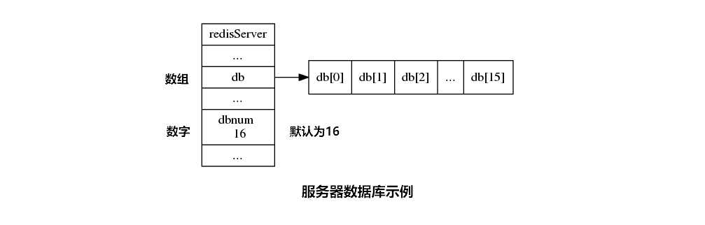
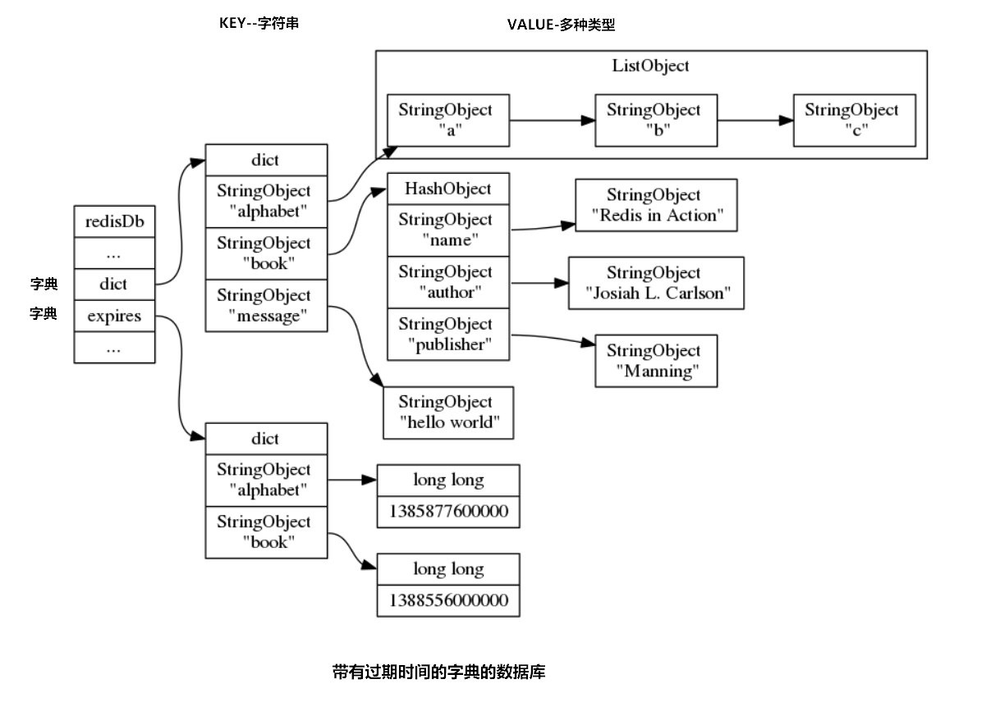

# Redis 数据库键值空间

> 2017-09-28 BoobooWei

[TOC]

## Redis数据库存储原理

> 没有编程语言基础的同学，我建议先学习python语言基础，在对数组、集合、字典的概念有所了解后，会更容易看懂Redis的底层，当然redis是用C语言写的。



- Redis数据库由**字典**构成， 所以对数据库的操作都是建立在字典操作之上的。
- Redis 服务器的所有数据库都保存在 `redisServer.db` 数组中， 而数据库的数量则由 `redisServer.dbnum` 属性保存`由配置文件中的databases参数控制`。
- 客户端通过修改目标数据库指针， 让它指向 `redisServer.db` 数组中的不同元素来切换不同的数据库。使用`命令select实现切换 `



- 数据库主要由 `dict` 和 `expires` 两个字典构成， 其中 `dict` 字典负责保存键值对， 而 `expires` 字典则负责保存键的过期时间。
- 数据库的键总是一个字符串对象， 而值则可以是任意一种 Redis 对象类型， 包括字符串对象、哈希表对象、集合对象、列表对象和有序集合对象， 分别对应字符串键、哈希表键、集合键、列表键和有序集合键。
- `expires` 字典的键指向数据库中的某个键， 而值则记录了数据库键的过期时间， 过期时间是一个以毫秒为单位的 UNIX 时间戳。


## Redis实践

### 切换数据库

```shell
# 登陆到服务器
[c:\~]$ ssh zyadmin@106.14.139.35 6622

127.0.0.1:6380> config get databases
1) "databases"
2) "16"
127.0.0.1:6380> select 0
OK
127.0.0.1:6380> set name booboo
OK
127.0.0.1:6380> dbsize
(integer) 1
127.0.0.1:6380> select 1
OK
127.0.0.1:6380[1]> dbsize
(integer) 0
127.0.0.1:6380[1]> select 17
(error) ERR invalid DB index
127.0.0.1:6380[1]> select 16
(error) ERR invalid DB index
127.0.0.1:6380[1]> select 15
OK
```

### 修改数据库的数量

```shell
#databases 16
databases 2
# 修改好配置后，重新启动服务
127.0.0.1:6380> config get databases
1) "databases"
2) "2"
127.0.0.1:6380> select 3
(error) ERR invalid DB index
127.0.0.1:6380> select 2
(error) ERR invalid DB index
127.0.0.1:6380> select 1
OK
127.0.0.1:6380[1]> select 0
OK
```

### 插入和查看键值

```shell
# 字符串string name='booboo'
# hash散列 user={'姓名':'superman', '性别':'女', '身高':180, '体重':'75kg', '年龄':28, '工作':'DBA'}
# 列表list hot=[100,20,200,30]

set name booboo
hmset user '姓名' 'superman'  '性别' '女' '身高' 180 '体重' '75kg'  '年龄' 28  '工作' 'DBA'
lpush hot 100 20 200 300 30

get name
lrange hot 0 3
hgetall user
hget user 姓名
```


### 设定和查看过期值

```shell
127.0.0.1:6380> expire name 30
(integer) 1
127.0.0.1:6380> ttl name
(integer) 28
127.0.0.1:6380> ttl name
(integer) 25
127.0.0.1:6380> ttl name
(integer) 24
127.0.0.1:6380> expire user 5
(integer) 1
127.0.0.1:6380> ttl user
(integer) 2
127.0.0.1:6380> ttl user
(integer) -2
127.0.0.1:6380> ttl user
(integer) -2
127.0.0.1:6380> ttl name
(integer) -2
# 过期后显示"-2"
```

## Python模拟Redis数据库

```shell
[root@ToBeRoot alidata]# cat redis-cli
#!/usr/bin/python
#coding=utf8

import os
import sys
import time


class redisServer:
	def __init__(self,dbnum):
		self.db=[]
		self.dicta={}
		self.expires={}
		self.dbnum=dbnum
		for i in xrange(self.dbnum):
			self.db.append('redisDB'+str(i))
	def redisDB(self,num):
		self.redisDB='redisDB'+str(num)

	def setstring(self,key,value):
		self.dicta[key]=value

	def setlist(self,key,*value):
		self.dicta[key]=list(value)

	def getstringkey(self,key):
		print self.dicta[key]

	def getlistkey(self,key,s,e):	
		for i in self.dicta[key]:
			for j in i[s:e]:
				sys.stdout.write(str(j)+' ')
		print


if __name__=='__main__': 
	databases=16
	r = redisServer(databases)

	a_str='Welcome to My Redis! '+time.strftime('%Y-%m-%d %H:%M:%S',time.localtime(time.time()))
	print a_str
	while True:
		b_str=raw_input('127.0.0.1:6379 > ')
	
		b_list=b_str.split()

		if b_list == ['config','get','databases']:
			print r.dbnum
			continue
		if b_list[0] == 'exit':
			break		
		if b_list[0] == 'select':
			print b_list[1]
			continue	
		if b_list[0] == 'set':
			# 字符串string name='booboo'
			r.setstring(b_list[1],b_list[2])
			continue
		if b_list[0] == 'get':
			r.getstringkey(b_list[1])
			continue
		if b_list[0] == 'rpush':
			# 列表list hot=[100,20,200,30]
			r.setlist(b_list[1],b_list[2:])
			continue
		if b_list[0] == 'lrange':
			r.getlistkey(b_list[1],int(b_list[2]),int(b_list[3]))
			continue
		if b_list[0] not in ['dbsize','exit','select','set','get','rpush','lrange']:
			print "error"
			continue

			
[root@ToBeRoot alidata]# cp redis-cli /usr/local/bin/redis-cli-test
[root@ToBeRoot alidata]# which redis-cli-test
/usr/local/bin/redis-cli-test
[root@ToBeRoot alidata]# redis-cli-test
Welcome to My Redis! 2017-10-12 18:38:02
127.0.0.1:6379 > config get databases
16
127.0.0.1:6379 > select 0
0
127.0.0.1:6379 > set name booboo
127.0.0.1:6379 > get name
booboo
127.0.0.1:6379 > set age 100
127.0.0.1:6379 > get age
100
127.0.0.1:6379 > rpush booboo 1 2 3 4 5 6
127.0.0.1:6379 > lrange booboo 0 4
1 2 3 4 5 
127.0.0.1:6379 > exit;
error
127.0.0.1:6379 > exit			
```

