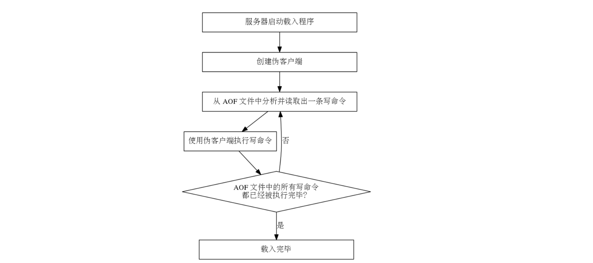

# Redis 持久化

> 2017-09-26 Booboo Wei

[TOC]

## 前言

Redis 服务器数据库示例：


Redis 的服务器进程就是一个事件循环（loop）， 这个循环中的`文件事件`负责接收客户端的命令请求， 以及向客户端发送命令回复， 而`时间事件`则负责执行像 serverCron 函数这样需要定时运行的函数。

**Redis中数据存储模式有2种：cache-only,persistence**

> - cache-only即只做为“缓存”服务，不持久数据，数据在服务终止后将消失，此模式下也将不存在“数据恢复”的手段，是一种安全性低/效率高/容易扩展的方式；
> - persistence即为内存中的数据持久备份到磁盘文件，在服务重启后可以恢复，此模式下数据相对安全。

对于persistence持久化存储，Redis提供了两种持久化方法：

> - Redis DataBase(简称RDB)
> - Append-only file (简称AOF)Redis持久化有两种方案
> - 4.0版本开始，有RDB_AOF混合模式，个人觉得混合模式是对AOF的升级。

## RDB 快照方式

RDB文件是一个经过压缩的二进制文件，通过该文件可以还原生成RDB文件时的数据库状态。

### 生成RDB文件

#### 手动保存


通过在命令行中输入`save`或`bgsave`来实现手动保存，区别如下：

| 命令     | 进程   | 阻塞服务 | 处理其他命令                                  |
| ------ | ---- | :--- | --------------------------------------- |
| save   | 当前   | 是    | 无法                                      |
| bgsave | 子进程  | 否    | 可以（除save、bgsave、bgrewriteaof、dbsize等以外） |

**实践：save和bgsave对比**

```shell
# 生成redis命令保存于afile
for i in `seq 1 1000000`
do
	echo set n$i $i >> afile
done
# 导入afile
redis-cli -p 6380 -a zyadmin < afile
# 会话1执行save的同时会话2执行命令
## 会话1
[root@ToBeRoot ~]# redis-cli -p 6380 -a zyadmin
127.0.0.1:6380> dbsize
(integer) 9495274
127.0.0.1:6380> save
OK
(6.46s)
## 会话2中的set命令在会话1的save执行成功后才会开始执行
[zyadmin@ToBeRoot ~]$ redis-cli -p 6380 -a zyadmin
127.0.0.1:6380> set d 1
OK
(5.91s)
# 会话1执行bgsave的同时会话2执行命令
[root@ToBeRoot ~]# redis-cli -p 6380 -a zyadmin
127.0.0.1:6380> bgsave
Background saving started
# 查看日志
[zyadmin@ToBeRoot log]$ tail -f redis6379.log
6110:M 13 Oct 11:36:23.066 * Background saving started by pid 6160
6160:C 13 Oct 11:36:28.789 * DB saved on disk
6160:C 13 Oct 11:36:28.796 * RDB: 0 MB of memory used by copy-on-write
6110:M 13 Oct 11:36:28.875 * Background saving terminated with success
[root@ToBeRoot ~]# ps -ef|grep redis-serve[r]
root      6110     1  6 11:32 ?        00:00:28 redis-server 127.0.0.1:6380
# 会话2没有被阻塞
[zyadmin@ToBeRoot ~]$ redis-cli -p 6380 -a zyadmin
127.0.0.1:6380> set e 2
OK
```

无论是save还是bgsave每执行一次都会将当前数据库状态写入磁盘。（全备）


#### 自动间隔性保存

配置文件

```shell
save 900 1 #刷新快照到硬盘中，必须满足两者要求才会触发，即900秒之后至少1个关键字发生变化。
save 300 10 #必须是300秒之后至少10个关键字发生变化。
save 60 10000 #必须是60秒之后至少10000个关键字发生变化。
stop-writes-on-bgsave-error yes #后台存储错误停止写。
rdbcompression yes #使用LZF压缩rdb文件。
rdbchecksum yes #存储和加载rdb文件时校验。
dbfilename dump.rdb #设置rdb文件名。
dir ./ #设置工作目录，rdb文件会写入该目录。
```


记录了服务器触发自动 BGSAVE 条件的 saveparams 属性。


记录服务器最后一次执行 SAVE 或者 BGSAVE 的时间， 以及自最后一次保存 RDB 文件以来， 服务器进行了多少次写入的 lastsave 属性和 dirty 属性。


用于记录和检查服务器是否需要自动执行 BGSAVE 的相关属性和数据结构的示例。


通过info查看相关信息

```shell
# Persistence    
loading:0 #一个标志值，记录了服务器是否正在载入持久化文件
rdb_changes_since_last_save:12124  #距离最后一次成功创建持久化文件之后，一共改变了多少个键值=dity
rdb_bgsave_in_progress:0 # 一个标志值，记录服务器是否正在创建RDB文件
rdb_last_save_time:1507867811 # 最近一次成功创建RDB文件的UNIX时间戳=lastsave
rdb_last_bgsave_status:ok # 一个标志值，记录了最后一次创建RDB文件的结果是成功还是失败   
rdb_last_bgsave_time_sec:6 # 记录最后一次创建RDB文件耗费的秒数
rdb_current_bgsave_time_sec:-1 # 如果服务器正在创建RDB文件，那么这个值记录的就是当前的创建RDB操作已经耗费了多长时间（单位为秒）
```

可以通过观察服务器运行状态来指定save的配置

* 当前时间为N
* 最近一次save的时间为L
* 最近一次save后的dity数量为D

```shell
每秒平均变化key的数量 = D/(N-L)
```

例如

```shell
mysql> select 12124/(unix_timestamp(now())-1507867811);
+------------------------------------------+
| 12124/(unix_timestamp(now())-1507867811) |
+------------------------------------------+
|                                  13.4412 |
+------------------------------------------+
```

得到平均每秒13.4412个key的变化，则save配置可以设置为

```shell
save 900 1 #刷新快照到硬盘中，必须满足两者要求才会触发，即900秒之后至少1个关键字发生变化。
save 300 10 #必须是300秒之后至少10个关键字发生变化。
save 60 700 #必须是60秒之后至少700个关键字发生变化。

mysql> select 12124/(unix_timestamp(now())-1507867811)*60;
+---------------------------------------------+
| 12124/(unix_timestamp(now())-1507867811)*60 |
+---------------------------------------------+
|                                    711.7808 |
+---------------------------------------------+
# 这种配置非常消耗IO，如果redis服务器每分钟的脏数据在711，那么这样的save配置会每分钟刷盘一次。刷盘太过频繁会影响IO
# 将刷盘频率控制在2分钟一次，则2分钟大概会产生1422个dirty key 
save 900 1 #刷新快照到硬盘中，必须满足两者要求才会触发，即900秒之后至少1个关键字发生变化。
save 300 10 #必须是300秒之后至少10个关键字发生变化。
save 60 1400 #必须是60秒之后至少1400个关键字发生变化

# 满足N-L>=60 or dirty>= 1400 就会刷盘

# 思考会丢数据吗？
比如从上一次刷盘到现在已经过去59秒，脏key为10000个，服务器宕机，则丢失这10000个key；
比如从上一次刷盘到现在已经过去60秒，脏key为699个，服务器宕机了，则丢失699个key。
```

**如果Redis用作缓存，例如用于Session保存，不推荐快照保存，对整体的性能影响会很大。**

**实践：关闭自动关闭 RDB 功能**

```shell
# 永久生效
1. 修改配置文件，注释掉save的行
2. 重启服务

# 当前实例生效
1. 关闭 RDB 功能 config set save ""
[root@ToBeRoot test]# redis-cli -p 6380 -a zyadmin
127.0.0.1:6380> config get save
1) "save"
2) "900 1 300 10 60 10000"
127.0.0.1:6380> config set save ""
OK
127.0.0.1:6380> config get save
1) "save"
2) ""
```


### 读懂RDB文件

#### 查看RDB文件

```shell
# 清空当前数据
[root@ToBeRoot 6379]# redis-cli -p 6380 -a zyadmin
127.0.0.1:6380> flushdb
OK
(5.27s)
127.0.0.1:6380> dbsize
(integer) 0
127.0.0.1:6380> exit
# 通过od -c 将二进制转为字符查看 dump.rdb文件
[root@ToBeRoot 6379]# od -c dump.rdb | head -n 20
0000000   R   E   D   I   S   0   0   0   7 372  \t   r   e   d   i   s
0000020   -   v   e   r 005   3   .   2   .   9 372  \n   r   e   d   i
0000040   s   -   b   i   t   s 300     372 005   c   t   i   m   e 302
0000060 357   Q 340   Y 372  \b   u   s   e   d   -   m   e   m 302 230
0000100 036  \t  \0 377 272 323   8 236   A 003 253   I
0000114

[root@ToBeRoot 6379]# od -cx dump.rdb 
0000000   R   E   D   I   S   0   0   0   7 372  \t   r   e   d   i   s
           4552    4944    3053    3030    fa37    7209    6465    7369
0000020   -   v   e   r 005   3   .   2   .   9 372  \n   r   e   d   i
           762d    7265    3305    322e    392e    0afa    6572    6964
0000040   s   -   b   i   t   s 300     372 005   c   t   i   m   e 302
           2d73    6962    7374    20c0    05fa    7463    6d69    c265
0000060 357   Q 340   Y 372  \b   u   s   e   d   -   m   e   m 302 230
           51ef    59e0    08fa    7375    6465    6d2d    6d65    98c2
0000100 036  \t  \0 377 272 323   8 236   A 003 253   I
           091e    ff00    d3ba    9e38    0341    49ab
```

#### RDB文件结构

| 格式   | Header            |               | Body        |                                          |           | Footer |                                 |
| ---- | ----------------- | ------------- | ----------- | ---------------------------------------- | --------- | ------ | ------------------------------- |
| 字节   | 5                 | 4             | 长度不固定       | 长度不固定                                    | 长度不固定     | 1      | 8                               |
| 功能   | Magic String      | db_version    | DB Selector | AUX Fields                               | Key-Value | EOF    | checksum                        |
| 空库   | R   E   D   I   S | 0   0   0   7 | 372  \t     | r   e   d   i   s -   v   e   r 005   3   .   2   .   9 372  \n   r   e   d   i s   -   b   i   t   s 300     372 005   c   t   i   m   e 302 357   Q 340   Y 372  \b   u   s   e   d   -   m   e   m 302 230 036  \t  \0 |           | 377    | 272 323   8 236   A 003 253   I |

**redis3.0版本的RDB版本号为6，redis3.2的版本号为7**

FA开头表示后跟AUX Fields,记录生成Dump文件的Redis相关信息，例如redis-ver、redis-bits、ctime、used-mem、aof-preamble和repl-id等；

```shell
# 插入key并刷盘
[root@ToBeRoot 6379]# redis-cli -p 6380 -a zyadmin
127.0.0.1:6380> set name booboo
OK
127.0.0.1:6380> get name
"booboo"
127.0.0.1:6380> save
OK
# 查看dump.rdb
[root@ToBeRoot 6379]# od -c dump.rdb 
0000000   R   E   D   I   S   0   0   0   7 372  \t   r   e   d   i   s
0000020   -   v   e   r 005   3   .   2   .   9 372  \n   r   e   d   i
0000040   s   -   b   i   t   s 300     372 005   c   t   i   m   e 302
0000060   p   q 340   Y 372  \b   u   s   e   d   -   m   e   m 302 330
0000100 276  \t  \0 376  \0 373 001  \0  \0 004   n   a   m   e 006   b
0000120   o   o   b   o   o 377   N   1 335 343   y 370   V 352
0000136

# 376  \0 373 001  \0  \0 004   n   a   m   e 006   b   o   o   b   o   o
# 376  \0 = select 0
# \0 004   n   a   m   e 006   b   o   o   b   o   o
# 字符串类型 4字节的 name 6字节的 booboo 
```


### 导入RDB文件


目前没有命令用于载入RDB文件，只要Redis服务器在启动时检测到RDB文件存在，就会自动载入该文件（在没有开启AOF的情况下）。

服务器在载入RDB文件期间，会一直处于阻塞状态，直到载入工作完成为止。

负责创建和载入 RDB 文件的两个函数之间的关系


### 修复RDB文件 

`redis-check-rdb`程序可用于修复rdb文件

```shell
[root@ToBeRoot 6379]# redis-check-rdb dump.rdb 
[offset 0] Checking RDB file dump.rdb
[offset 26] AUX FIELD redis-ver = '3.2.9'
[offset 40] AUX FIELD redis-bits = '32'
[offset 52] AUX FIELD ctime = '1507881328'
[offset 67] AUX FIELD used-mem = '638680'
[offset 69] Selecting DB ID 0
[offset 94] Checksum OK
[offset 94] \o/ RDB looks OK! \o/
[info] 1 keys read
[info] 0 expires
[info] 0 already expired
```


### 小结

- RDB 文件用于保存和还原 Redis 服务器所有数据库中的所有键值对数据。
- SAVE 命令由服务器进程直接执行保存操作，所以该命令会阻塞服务器。
- BGSAVE 命令由子进程执行保存操作，所以该命令不会阻塞服务器。
- 服务器状态中会保存所有用 `save` 选项设置的保存条件，当任意一个保存条件被满足时，服务器会自动执行 BGSAVE 命令。
- RDB 文件是一个经过压缩的二进制文件，由多个部分组成。
- 对于不同类型的键值对， RDB 文件会使用不同的方式来保存它们。

## AOF日志方式

AOF 持久化功能的实现可以分为命令追加（append）、文件写入、文件同步（sync）三个步骤。

### 生成AOF文件


#### 自动生成

1.离线修改配置，永久生效

```shell
appendonly no #是否要日志
appendfsync no # 系统缓冲,统一写,速度快
appendfsync always # 系统不缓冲,直接写,慢,丢失数据少
appendfsync everysec #折中,每秒写1次

no-appendfsync-on-rewrite no #为yes,则其他线程的数据放内存里,合并写入(速度快,容易丢失的多)
auto-AOF-rewrite-percentage 100 #当前aof文件是上次重写是大N%时重写(#当AOF日志文件即将增长到指定百分比时，redis通过调用BGREWRITEAOF是否自动重写AOF日志文件。)
auto-AOF-rewrite-min-size 64mb #aof重写至少要达到的大小
```

2.在线修改配置，当前实例生效

```shell
CONFIG SET appendonly yes
```


**AOF 持久化的效率和安全性**

服务器配置 `appendfsync` 选项的值直接决定 AOF 持久化功能的效率和安全性。


同步命令到 AOF 文件的整个过程可以分为三个阶段：

1. 命令追加（append）:当 AOF 持久化功能处于打开状态时， 服务器在执行完一个写命令之后， 会以协议格式将被执行的写命令追加到服务器状态的 aof_buf 缓冲区的末尾。
2. 文件写入:因为服务器在处理文件事件时可能会执行写命令， 使得一些内容被追加到 `aof_buf` 缓冲区里面， 所以在服务器每次结束一个事件循环之前， 它都会调用 `flushAppendOnlyFile` 函数， 考虑是否需要将 `aof_buf` 缓冲区中的内容写入和保存到 AOF 文件里面。
3. 文件同步（sync）：

| `appendfsync` | `flushAppendOnlyFile` 函数的行为              | 效率   | 丢失事件                    |
| ------------- | ---------------------------------------- | ---- | ----------------------- |
| `always`      | 将 `aof_buf` 缓冲区中的所有内容写入并同步到 AOF 文件。      | 最慢   | 丢失一个事件                  |
| `everysec`    | 将 `aof_buf` 缓冲区中的所有内容写入到 AOF 文件， 如果上次同步 AOF 文件的时间距离现在超过一秒钟， 那么再次对 AOF 文件进行同步， 并且这个同步操作是由一个线程专门负责执行的。 | 快    | 丢失一秒钟                   |
| `no`          | 将 `aof_buf` 缓冲区中的所有内容写入到 AOF 文件， 但并不对 AOF 文件进行同步， 何时同步由操作系统来决定。 | 最快   | 丢失上次同步 AOF 文件之后的所有写命令数据 |

如果用户没有主动为 `appendfsync` 选项设置值， 那么 `appendfsync` 选项的默认值为 `everysec`

- 当 `appendfsync` 的值为 `always` 时， 服务器在每个事件循环都要将 `aof_buf` 缓冲区中的所有内容写入到 AOF 文件， 并且同步 AOF 文件， 所以 `always` 的效率是 `appendfsync` 选项三个值当中最慢的一个， 但从安全性来说， `always` 也是最安全的， 因为即使出现故障停机， AOF 持久化也只会丢失一个事件循环中所产生的命令数据。
- 当 `appendfsync` 的值为 `everysec` 时， 服务器在每个事件循环都要将 `aof_buf` 缓冲区中的所有内容写入到 AOF 文件， 并且每隔超过一秒就要在子线程中对 AOF 文件进行一次同步： 从效率上来讲， `everysec` 模式足够快， 并且就算出现故障停机， 数据库也只丢失一秒钟的命令数据。
- 当 `appendfsync` 的值为 `no` 时， 服务器在每个事件循环都要将 `aof_buf` 缓冲区中的所有内容写入到 AOF 文件， 至于何时对 AOF 文件进行同步， 则由操作系统控制。

因为处于 `no` 模式下的 `flushAppendOnlyFile` 调用无须执行同步操作， 所以该模式下的 AOF 文件写入**速度总是最快的**， 不过因为这种模式会在系统缓存中积累一段时间的写入数据， 所以该模式的单次同步时长通常是三种模式中时间最长的： 从平摊操作的角度来看，`no` 模式和 `everysec` 模式的效率类似， 当出现故障停机时， 使用 `no` 模式的服务器将丢失上次同步 AOF 文件之后的所有写命令数据。


#### 手动生成

从 Redis 2.4 开始， AOF 重写由 Redis 自行触发， BGREWRITEAOF 仅仅用于手动触发重写操作。

```flow
s=>start: 内容太多
t1=>inputoutput: AOF文件体积太大
t2=>inputoutput: AOF 还原需要时间越多
e=>end: 精简加速还原
s->t1->t2->e
```


```shell
127.0.0.1:6380> bgrewriteaof
Background append only file rewriting started

# 日志
6110:M 13 Oct 16:32:53.090 * Background append only file rewriting started by pid 7833
6110:M 13 Oct 16:32:53.115 * AOF rewrite child asks to stop sending diffs.
7833:C 13 Oct 16:32:53.115 * Parent agreed to stop sending diffs. Finalizing AOF...
7833:C 13 Oct 16:32:53.115 * Concatenating 0.00 MB of AOF diff received from parent.
7833:C 13 Oct 16:32:53.115 * SYNC append only file rewrite performed
7833:C 13 Oct 16:32:53.116 * AOF rewrite: 0 MB of memory used by copy-on-write
6110:M 13 Oct 16:32:53.139 * Background AOF rewrite terminated with success
6110:M 13 Oct 16:32:53.139 * Residual parent diff successfully flushed to the rewritten AOF (0.00 MB)
6110:M 13 Oct 16:32:53.139 * Background AOF rewrite finished successfully
```

**AOFREWRITE重写的原理**


| 时间   | 服务器进程（父进程）                               | 子进程                |
| ---- | ---------------------------------------- | ------------------ |
| T1   | 执行命令`set name a`                         |                    |
| T2   | 执行命令`set age 10`                         |                    |
| T3   | 执行命令`set time 2`                         |                    |
| T4   | 执行命令BGREWRITEAOF，创建子进程，执行AOF文件重写         | 开始AOF重写            |
| T5   | 执行命令`set a 1`                            | 执行重写操作             |
| T6   | 执行命令`set b 2`                            | 执行重写操作             |
| T7   | 执行命令`set c 3`                            | 完成AOF文件重写，向父进程发送信号 |
| T8   | 接受到子进程发送的信号，将命令`set a 1、set b 2、set c 3`追加到新AOF文件的末尾 |                    |
| T9   | 用新AOF文件覆盖旧AOF文件                          |                    |

以上就是AOF后台重写，也即是BGREWRITEAOF命令的实现原理。

### 读懂AOF文件

```shell
[root@ToBeRoot 6379]# cat appendonly.aof 
*2
$6
SELECT
$1
0
*3
$3
SET
$4
name
$6
booboo
```

* 以`*`开头的数字：表示redis命令中包含几个单词
* 以`$`开头的数字：表示单词的字节数
* 除了 `SELECT`命令是 AOF 程序自己加上去的之外， 其他命令都是之前我们在终端里执行的命令。

### 导入AOF文件



```shell
# info
aof_enabled:0      #一个标志值，记录了AOF是否处于打开状态 
aof_rewrite_in_progress:0    #记录了服务器是否正在创建AOF文件
aof_rewrite_scheduled:0     #记录了RDB文件创建完之后，是否需要执行预约的AOF重写操作
aof_last_rewrite_time_sec:-1        #记录了最后一次AOF重写操作的耗时
aof_current_rewrite_time_sec:-1    #如果服务器正在进行AOF重写操作，那么这个值记录的就是当前重写操作已经耗费的时间（单位是秒）
aof_last_bgrewrite_status:ok    #记录了最后一次重写AOF文件的结果是成功还是失败
aof_last_write_status:ok 
```

### 修复AOF文件 

### 小结

- AOF 文件通过保存所有修改数据库的写命令请求来记录服务器的数据库状态。
- AOF 文件中的所有命令都以 Redis 命令请求协议的格式保存。
- 命令请求会先保存到 AOF 缓冲区里面， 之后再定期写入并同步到 AOF 文件。
- `appendfsync` 选项的不同值对 AOF 持久化功能的安全性、以及 Redis 服务器的性能有很大的影响。
- 服务器只要载入并重新执行保存在 AOF 文件中的命令， 就可以还原数据库本来的状态。
- AOF 重写可以产生一个新的 AOF 文件， 这个新的 AOF 文件和原有的 AOF 文件所保存的数据库状态一样， 但体积更小。
- AOF 重写是一个有歧义的名字， 该功能是通过读取数据库中的键值对来实现的， 程序无须对现有 AOF 文件进行任何读入、分析或者写入操作。
- 在执行 BGREWRITEAOF 命令时， Redis 服务器会维护一个 AOF 重写缓冲区， 该缓冲区会在子进程创建新 AOF 文件的期间， 记录服务器执行的所有写命令。 当子进程完成创建新 AOF 文件的工作之后， 服务器会将重写缓冲区中的所有内容追加到新 AOF 文件的末尾， 使得新旧两个 AOF 文件所保存的数据库状态一致。 最后， 服务器用新的 AOF 文件替换旧的 AOF 文件， 以此来完成 AOF 文件重写操作。


## 总结

### 持久化方式的优缺点

| 持久化          | 解释                                       | 优点           | 缺点               |
| ------------ | ---------------------------------------- | ------------ | ---------------- |
| RDB          | 一份内存快照，保存了创建RDB文件那个时间点的redis全量数据         | 数据文件小；创建、恢复快 | 无法保存创建RDB之后的增量数据 |
| AOF          | 一份执行日志保存所有对redis进行更改的命令增量数据              | 体积相对较大       | 恢复数据较慢           |
| AOFREWRITE   | 先写一份全量数据到新AOF文件中再追加增量;全量数据是以redis命令的格式写入 | 体积相对较小       | 恢复数据较慢           |
| RDB-AOF混合持久化 | 先以RDB格式写入全量数据再追加增量日志，现在4.0实现了这一特性        | 体积相对较小       | 恢复数据较快           |

### 持久化文件载入流程

服务器判断是载入 RDB 文件还是载入 AOF 文件的流程


### RDB-AOF混合持久化原理


先以RDB格式写入全量数据再追加增量日志，现在4.0实现了这一特性。

### 抉择

一般来说， 如果想达到足以媲美 MySQL 的数据安全性， 你应该同时使用两种持久化功能。

如果你非常关心你的数据， 但仍然可以承受数分钟以内的数据丢失， 那么你可以只使用 RDB 持久化。

其余情况建议选择AOF。


