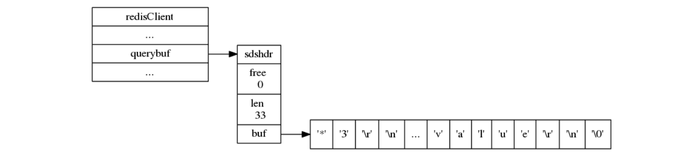
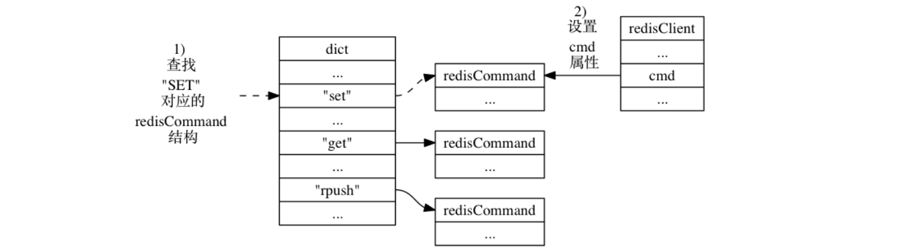

# Redis_client

> 2017-10-16 BoobooWei

[TOC]

## 客户端分类


### 普通客户端

使用套接字来与服务器进行通讯，服务器会记录客户端套接字的描述符。

### 伪客户端

处理的命令请求来源于 AOF 文件或者 Lua 脚本， 而不是网络，这种客户端不需要套接字连接， 也不需要记录套接字描述符。

* 处理 Lua 脚本的伪客户端在服务器初始化时创建， 这个客户端会一直存在， 直到服务器关闭。
* 载入 AOF 文件时使用的伪客户端在载入工作开始时动态创建， 载入工作完毕之后关闭。

##  客户端属性

> [参考文档](http://redisbook.com/preview/client/redis_client_property.html)

对客户端状态中比较通用的那部分属性进行介绍，客户端状态包含的属性可以分为两类：

- 一类是比较通用的属性， 这些属性很少与特定功能相关， 无论客户端执行的是什么工作， 它们都要用到这些属性。
- 另外一类是和特定功能相关的属性， 比如操作数据库时需要用到的 `db` 属性和 `dictid` 属性， 执行事务时需要用到的 `mstate` 属性， 以及执行 WATCH 命令时需要用到的 `watched_keys` 属性， 等等。

### 创建普通客户端

```shell
redis-cli -h <ip> -p <port> -a <password>
```

### 获取客户端属性

命令`client list`获取客户端属性。

```shell
[root@ToBeRoot ~]# redis-cli -p 6380 -a zyadmin
127.0.0.1:6380> client list
id=16 addr=127.0.0.1:36044 fd=5 name= age=9 idle=0 flags=N db=0 sub=0 psub=0 multi=-1 qbuf=0 qbuf-free=32768 obl=0 oll=0 omem=0 events=r cmd=client
```

### 读懂客户端属性

客户端属性如下表所示：

| 属性        | 值               | 含义                                       |
| --------- | --------------- | ---------------------------------------- |
| id        | 16              | 客户端标识                                    |
| addr      | 127.0.0.1:36044 | 客户端的地址和端口                                |
| fd        | -1 or 大于 -1的整数  | 伪客户端（fake client）载入 AOF 文件并还原数据库状态；执行 Lua 脚本中包含的 Redis 命令。普通客户端的 `fd` 属性的值为大于 `-1` 的整数 |
| name      |                 | 在默认情况下， 一个连接到服务器的客户端是没有名字的。              |
| age       | 9               | 以秒计算的已连接时长                               |
| flags     | N               | 记录了客户端的角色（role）， 以及客户端目前所处的状态            |
| db        | 0               | 该客户端正在使用的数据库 ID                          |
| sub       | 0               | 已订阅频道的数量                                 |
| multi     | -1              | 在事务中被执行的命令数量                             |
| qbuf      | 0               | 输入缓冲区的大小会根据输入内容动态地缩小或者扩大， 但它的最大大小不能超过 1 GB ， 否则服务器将关闭这个客户端。 |
| qbuf-free | 32768           | 查询缓冲区剩余空间的长度（字节为单位， 0 表示没有剩余空间）          |
| obl       | 0               | 输出缓冲区的长度（字节为单位， 0 表示没有分配输出缓冲区）           |
| oll       | 0               | 输出列表包含的对象数量（当输出缓冲区没有剩余空间时，命令回复会以字符串对象的形式被入队到这个队列里） |
| omem      | 0               | 输出缓冲区和输出列表占用的内存总量                        |
| events    | r               | 文件描述符事件                                  |
| cmd       | client          | 最近一次执行的命令                                |

客户端 flag 可以由以下部分组成：

- O ： 客户端是 MONITOR 模式下的附属节点（slave）
- S ： 客户端是一般模式下（normal）的附属节点
- M ： 客户端是主节点（master）
- x ： 客户端正在执行事务
- b ： 客户端正在等待阻塞事件
- i ： 客户端正在等待 VM I/O 操作（已废弃）
- d ： 一个受监视（watched）的键已被修改， EXEC 命令将失败
- c : 在将回复完整地写出之后，关闭链接
- u : 客户端未被阻塞（unblocked）
- A : 尽可能快地关闭连接
- N : 未设置任何 flag

文件描述符事件可以是：

- r : 客户端套接字（在事件 loop 中）是可读的（readable）
- w : 客户端套接字（在事件 loop 中）是可写的（writeable）

### 设置客户端属性

#### 设置名字

命令`client setname` 为客户端设置一个名字， 让客户端的身份变得更清晰。

```shell
127.0.0.1:6380> client setname test1
OK
127.0.0.1:6380> client list
id=16 addr=127.0.0.1:36044 fd=5 name=test1 age=965 idle=0 flags=N db=0 sub=0 psub=0 multi=-1 qbuf=0 qbuf-free=32768 obl=0 oll=0 omem=0 events=r cmd=client
```

命令`client getname`获取客户端名字

```shell
127.0.0.1:6380> client getname
"test1"
```

命令`client setname ""`清空名字

```shell
127.0.0.1:6380> client setname ""
OK
```

#### 关闭客户端

命令`client kill` 用于关闭客户端连接。

```
redis 127.0.0.1:6379> CLIENT KILL ip:port
```

#### 阻塞客户端

命令`client pause` 用于阻塞客户端命令一段时间（以毫秒计）。

redis Client Pause 命令基本语法如下：

```
redis 127.0.0.1:6379> CLIENT PAUSE timeout 
```
## 客户端状态

### clients 链表

客户端在服务器状态 `clients` 属性中的样子:


- 服务器状态结构使用 `clients` 链表连接起多个客户端状态， 新添加的客户端状态会被放到链表的末尾。

### 输入缓冲区

Redis 客户端的输入缓冲区示例:



- 输入缓冲区记录了客户端发送的命令请求， 这个缓冲区的大小不能超过 1 GB 。

### 命令与命令参数

Redis 客户端的 `argv` 属性和 `argc` 属性示例：


- 命令的参数和参数个数会被记录在客户端状态的 `argv` 和 `argc` 属性里面， 而 `cmd` 属性则记录了客户端要执行命令的实现函数。
- 在服务器将客户端发送的命令请求保存到客户端状态的 `querybuf` 属性之后， 服务器将对命令请求的内容进行分析， 并将得出的命令参数以及命令参数的个数分别保存到客户端状态的 `argv` 属性和 `argc` 属性。
- `argv` 属性是一个数组， 数组中的每个项都是一个字符串对象： 其中 `argv[0]` 是要执行的命令， 而之后的其他项则是传给命令的参数。
- `argc` 属性则负责记录 `argv` 数组的长度。

### 命令的实现函数

服务器在 `argv[0]` 为 `"SET"` 时， 查找命令表并将客户端状态的 `cmd` 指针指向目标 `redisCommand` 结构的整个过程如下：



### 输出缓冲区

执行命令所得的命令回复会被保存在客户端状态的输出缓冲区里面， 每个客户端都有两个输出缓冲区可用， 一个缓冲区的大小是固定的， 另一个缓冲区的大小是可变的：

- 固定大小的缓冲区用于保存那些长度比较小的回复， 比如 `OK` 、简短的字符串值、整数值、错误回复，等等。
- 可变大小的缓冲区用于保存那些长度比较大的回复， 比如一个非常长的字符串值， 一个由很多项组成的列表， 一个包含了很多元素的集合， 等等。

客户端的固定大小缓冲区由 `buf` 和 `bufpos` 两个属性组成：

* `buf` 是一个大小为 `REDIS_REPLY_CHUNK_BYTES` 字节的字节数组，`REDIS_REPLY_CHUNK_BYTES` 常量目前的默认值为 `16*1024` ， 也即是说， `buf` 数组的默认大小为 16 KB 。
* `bufpos` 属性则记录了 `buf` 数组目前已使用的字节数量。

使用固定大小缓冲区来保存返回值 `+OK\r\n` 的例子：


当 `buf` 数组的空间已经用完， 或者回复因为太大而没办法放进 `buf` 数组里面时， 服务器就会开始使用可变大小缓冲区。

* 可变大小缓冲区由 `reply` 链表和一个或多个字符串对象组成。


* 通过使用链表来连接多个字符串对象， 服务器可以为客户端保存一个非常长的命令回复， 而不必受到固定大小缓冲区 16 KB 大小的限制。

包含三个字符串对象的 `reply` 链表的例子：


#### 输出缓冲区限制

服务器使用两种模式来限制客户端输出缓冲区的大小：

* 硬性限制（hard limit）： 如果输出缓冲区大小超过了硬性限制所设置的大小，那么服务器立刻关闭客户端。
* 软性限制（soft limit）：如果输出缓冲区大小超过了软性限制所设置的大小，但是没有超过硬性限制，那么服务器将使用客户端状态结构的`obuf_soft_limit_reached_time`属性记录下**客户端到达软性限制的起始时间**；之后服务器会继续监视客户端，如果输出缓冲区的大小一直超过软性限制，并且持续时间超过服务器设定的时长，那么服务器将关闭客户端；相反地，如果输出缓冲区的大小在指定时间内，不再超出软性限制，那么客户端就不会被关闭，并且`obuf_soft_limit_reached_time`会被清零。

#### 限制配置

配置文件中通过`client-output-buffer-limit`来配置，如下：

```shell
client-output-buffer-limit normal 0 0 0
client-output-buffer-limit slave 256mb 64mb 60
client-output-buffer-limit pubsub 32mb 8mb 60
```

不同客户端有不同策略，策略如下：

* 对于普通客户端来说，限制为0，也就是不限制。因为普通客户端通常采用阻塞式的消息应答模式，何谓阻塞式呢？如：发送请求，等待返回，再发送请求，再等待返回。这种模式下，通常不会导致Redis服务器输出缓冲区的堆积膨胀；


* 对于Pub/Sub客户端（也就是发布/订阅模式），大小限制是8M，当输出缓冲区超过8M时，会关闭连接。持续性限制是，当客户端缓冲区大小持续60秒超过2M，则关闭客户端连接；


* 对于slave客户端来说，大小限制是256M，持续性限制是当客户端缓冲区大小持续60秒超过64M，则关闭客户端连接。

上述三种规则都是可以修改的。可以通过`CONFIG SET` 命令设置或者直接修改redis.conf文件。

```shell
#上面三个参数可能会出现如下问题
Client id=174607862 addr=10.11.24.158:59918 fd=19 name= age=261 idle=261 flags=S db=0 sub=0 psub=0 multi=-1 qbuf=0 qbuf-free=0 obl=11590 oll=2456 omem=70541940 events=r cmd=psync scheduled to be closed ASAP for overcoming of output buffer limits.
31799:M 27 Oct 23:07:57.660 # Connection with slave 10.11.24.158:18101 lost.
# 解决方法
/data/app/redis/bin/redis-cli -h 127.0.0.1 -p 18101  config set  client-output-buffer-limit "normal 0 0 0 slave 268435456 67108864 120 pubsub 33554432 8388608 120"
```

### 身份验证

客户端状态的 `authenticated` 属性用于记录客户端是否通过了身份验证：

* 如果 `authenticated` 的值为 `0` ， 那么表示客户端未通过身份验证； 
* 如果 `authenticated` 的值为 `1` ， 那么表示客户端已经通过了身份验证。

举个例子， 对于一个尚未进行身份验证的客户端来说， 客户端状态的 `authenticated` 属性将下 所示：

```shell
# 当客户端 authenticated 属性的值为 0 时， 除了 AUTH 命令之外， 客户端发送的所有其他命令都会被服务器拒绝执行：
[root@ToBeRoot ~]# redis-cli -p 6380
127.0.0.1:6380> client list
NOAUTH Authentication required.
127.0.0.1:6380> ping
(error) NOAUTH Authentication required.
127.0.0.1:6380> auth zyadmin
OK
# 当客户端通过 AUTH 命令成功进行身份验证之后， 客户端状态 authenticated 属性的值就会从 0 变为 1 
```

`authenticated` 属性仅在服务器启用了身份验证功能时使用： 如果服务器没有启用身份验证功能的话， 那么即使 `authenticated` 属性的值为 `0`（这是默认值）， 服务器也不会拒绝执行客户端发送的命令请求。

### 时间

客户端还有几个和时间有关的属性：

* `ctime` 属性记录了创建客户端的时间， 这个时间可以用来计算客户端与服务器已经连接了多少秒 —— `client list` 命令的 `age` 域记录了这个秒数；
* `lastinteraction` 属性记录了客户端与服务器最后一次进行互动（interaction）的时间， 这里的互动可以是客户端向服务器发送命令请求， 也可以是服务器向客户端发送命令回复—— `client list` 命令的 `idle` 域记录了这个秒数；
* `obuf_soft_limit_reached_time` 属性记录了输出缓冲区第一次到达软性限制（soft limit）的时间。

## 总结

- 服务器状态结构使用 `clients` 链表连接起多个客户端状态， 新添加的客户端状态会被放到链表的末尾。
- 客户端状态的 `flags` 属性使用不同标志来表示客户端的角色， 以及客户端当前所处的状态。
- 输入缓冲区记录了客户端发送的命令请求， 这个缓冲区的大小不能超过 1 GB 。
- 命令的参数和参数个数会被记录在客户端状态的 `argv` 和 `argc` 属性里面， 而 `cmd` 属性则记录了客户端要执行命令的实现函数。
- 客户端有固定大小缓冲区和可变大小缓冲区两种缓冲区可用， 其中固定大小缓冲区的最大大小为 16 KB ， 而可变大小缓冲区的最大大小不能超过服务器设置的硬性限制值。
- 输出缓冲区限制值有两种， 如果输出缓冲区的大小超过了服务器设置的硬性限制， 那么客户端会被立即关闭； 除此之外， 如果客户端在一定时间内， 一直超过服务器设置的软性限制， 那么客户端也会被关闭。
- 当一个客户端通过网络连接连上服务器时， 服务器会为这个客户端创建相应的客户端状态。 网络连接关闭、 发送了不合协议格式的命令请求、 成为 CLIENT_KILL 命令的目标、 空转时间超时、 输出缓冲区的大小超出限制， 以上这些原因都会造成客户端被关闭。
- 处理 Lua 脚本的伪客户端在服务器初始化时创建， 这个客户端会一直存在， 直到服务器关闭。
- 载入 AOF 文件时使用的伪客户端在载入工作开始时动态创建， 载入工作完毕之后关闭。