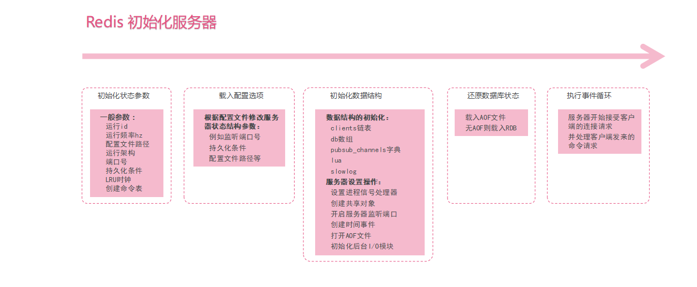

# Redis_Server_initialize

> 2017-11-15 Booboo

[TOC]

## 启动步骤

从启动 Redis 服务器， 到服务器可以接受外来客户端的网络连接这段时间， Redis 需要执行一系列初始化操作。

整个初始化过程可以分为以下五个步骤：

1. 初始化服务器状态结构
2. 载入配置选项
3. 初始化服务器数据结构
4. 还原数据库状态
5. 执行事件循环

## 总结

> ### Booboo笔记
>
> 其实服务启动的过程不就是你每天来公司上班时的过程吗？
>
> 1. 找到默认的办公桌坐下
> 2. 接个水烧开泡茶
> 3. 上个厕所也许
> 4. 回顾昨日事项
> 5. 开始今日工作任务，准备接单^ . ^