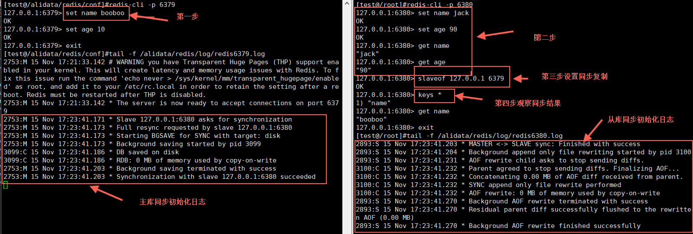

# Redis_replication

> 2017-11-15  Booboo

[toc]

初始化主从实战



```shell
# master
[test@/alidata/redis/conf]#redis-cli -p 6379
127.0.0.1:6379> set name booboo
OK
127.0.0.1:6379> set age 10
OK
127.0.0.1:6379> exit
[test@/alidata/redis/conf]#tail -f /alidata/redis/log/redis6379.log 
2753:M 15 Nov 17:21:33.142 # WARNING you have Transparent Huge Pages (THP) support enabled in your kernel. This will create latency and memory usage issues with Redis. To fix this issue run the command 'echo never > /sys/kernel/mm/transparent_hugepage/enabled' as root, and add it to your /etc/rc.local in order to retain the setting after a reboot. Redis must be restarted after THP is disabled.
2753:M 15 Nov 17:21:33.142 * The server is now ready to accept connections on port 6379
2753:M 15 Nov 17:23:41.171 * Slave 127.0.0.1:6380 asks for synchronization
2753:M 15 Nov 17:23:41.173 * Full resync requested by slave 127.0.0.1:6380
2753:M 15 Nov 17:23:41.173 * Starting BGSAVE for SYNC with target: disk
2753:M 15 Nov 17:23:41.173 * Background saving started by pid 3099
3099:C 15 Nov 17:23:41.186 * DB saved on disk
3099:C 15 Nov 17:23:41.186 * RDB: 0 MB of memory used by copy-on-write
2753:M 15 Nov 17:23:41.203 * Background saving terminated with success
2753:M 15 Nov 17:23:41.203 * Synchronization with slave 127.0.0.1:6380 succeeded
2753:M 15 Nov 17:38:42.088 * 1 changes in 900 seconds. Saving...
2753:M 15 Nov 17:38:42.090 * Background saving started by pid 5356
5356:C 15 Nov 17:38:42.147 * DB saved on disk
5356:C 15 Nov 17:38:42.147 * RDB: 0 MB of memory used by copy-on-write
2753:M 15 Nov 17:38:42.190 * Background saving terminated with success

# slave
[test@/root]#redis-cli -p 6380
127.0.0.1:6380> set name jack
OK
127.0.0.1:6380> set age 90
OK
127.0.0.1:6380> get name
"jack"
127.0.0.1:6380> get age
"90"
127.0.0.1:6380> slaveof 127.0.0.1 6379
OK
127.0.0.1:6380> keys *
1) "name"
127.0.0.1:6380> get name
"booboo"
127.0.0.1:6380> exit
[test@/root]#tail -f /alidata/redis/log/redis6380.log 
2893:S 15 Nov 17:23:41.203 * MASTER <-> SLAVE sync: Finished with success
2893:S 15 Nov 17:23:41.204 * Background append only file rewriting started by pid 3100
2893:S 15 Nov 17:23:41.231 * AOF rewrite child asks to stop sending diffs.
3100:C 15 Nov 17:23:41.232 * Parent agreed to stop sending diffs. Finalizing AOF...
3100:C 15 Nov 17:23:41.232 * Concatenating 0.00 MB of AOF diff received from parent.
3100:C 15 Nov 17:23:41.232 * SYNC append only file rewrite performed
3100:C 15 Nov 17:23:41.232 * AOF rewrite: 0 MB of memory used by copy-on-write
2893:S 15 Nov 17:23:41.270 * Background AOF rewrite terminated with success
2893:S 15 Nov 17:23:41.270 * Residual parent diff successfully flushed to the rewritten AOF (0.00 MB)
2893:S 15 Nov 17:23:41.270 * Background AOF rewrite finished successfully
```

