# 1_SQL_基础

> 2018-01-16 BoobooWei

[TOC]

## 学习环境

* [employees库](http://yk3.gokuai.com/file/lt905pbf#)

*安装方法*

1. 预先安装配置并启动MySQL5.7
2. 下载employees.sql.gz文件并解压
3. 导入employees库

```shell
[root@mastera0 install]# ls 
employees.sql.gz mysql-5.7.17-linux-glibc2.5-x86_64.tar.gz
[root@mastera0 install]# gunzip employees.sql.gz
[root@mastera0 install]# ls 
employees.sql mysql-5.7.17-linux-glibc2.5-x86_64.tar.gz
[root@mastera0 install]# mysql -e "create database booboo"
[root@mastera0 install]# mysql booboo < employees.sql

```


## 讲义

### SQL基本语法

#### 什么是SQL

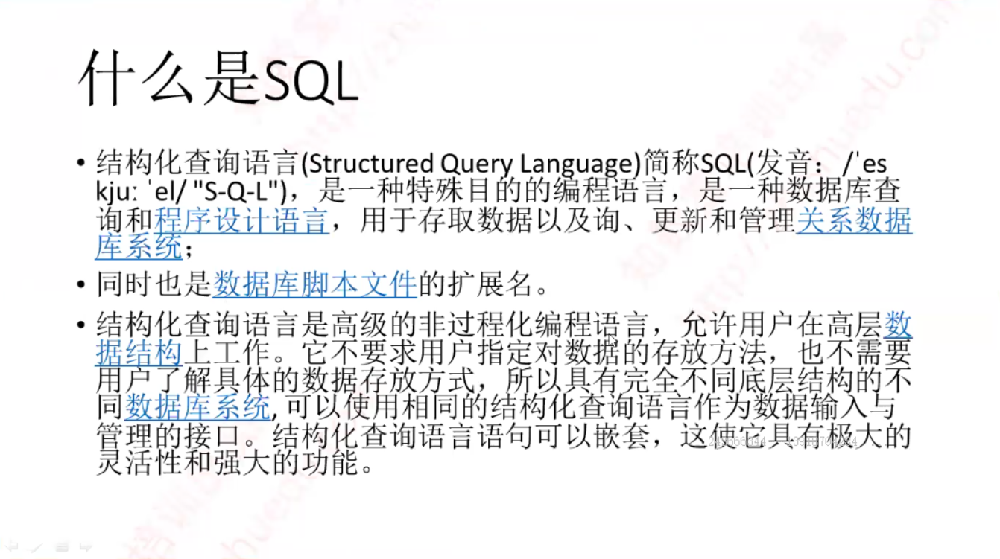

#### SQL分类


#### SQL主要内容

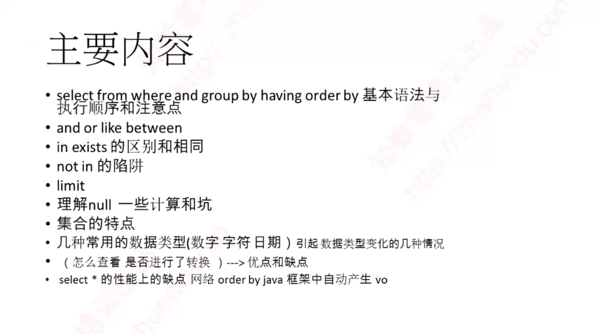

#### 练习库简介


#### 重点掌握的知识点

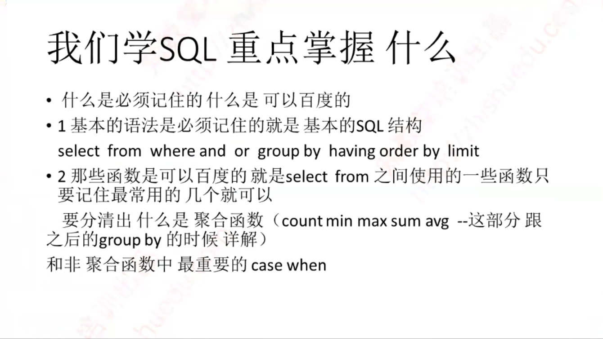

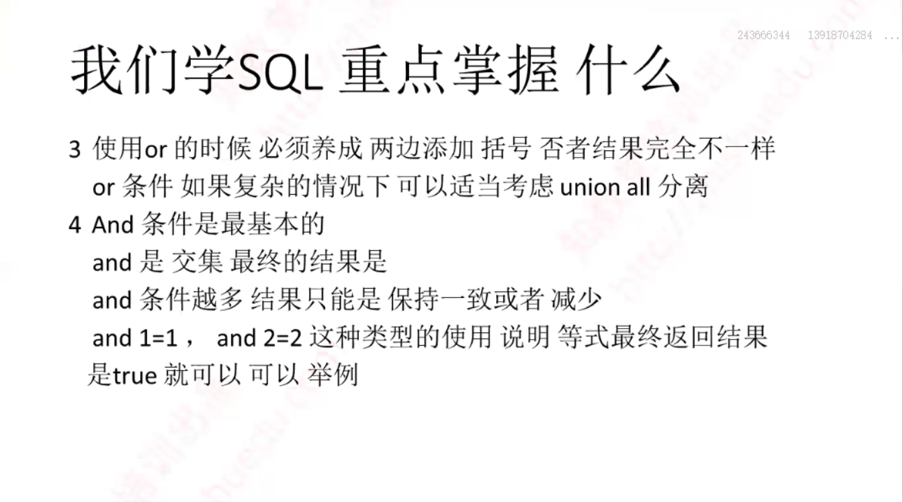


##### 基础的SQL语法

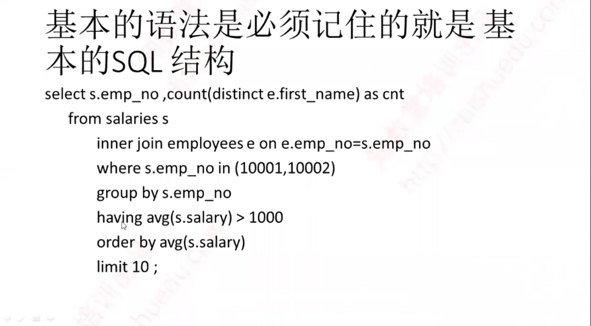

##### 基本的SQL结构


##### 常用函数ifnull，isnull


##### 常用函数now，sysdate


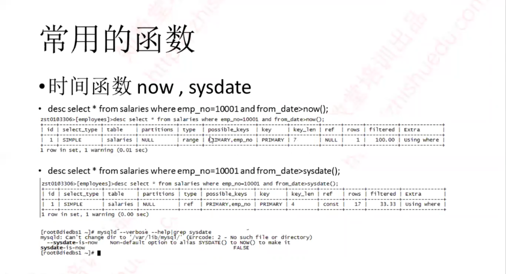

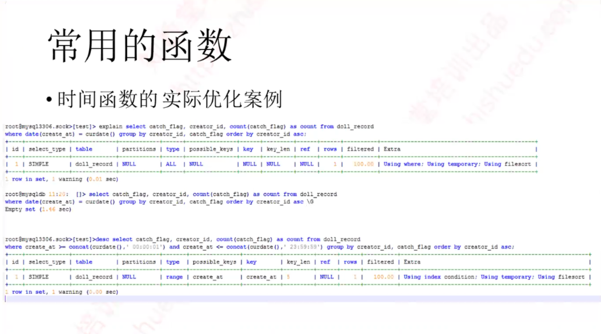

##### 常用函数rpad，lpad，ptrim，ltrim，trim


##### 常用函数concat


##### 条件判断case when


##### 单引号的显示

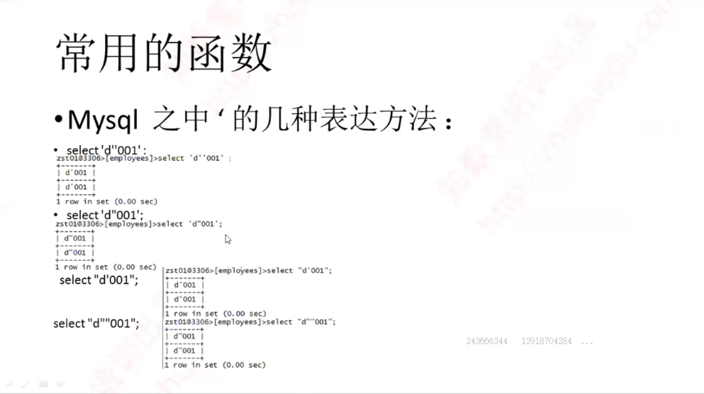

##### 数字类型的特殊性


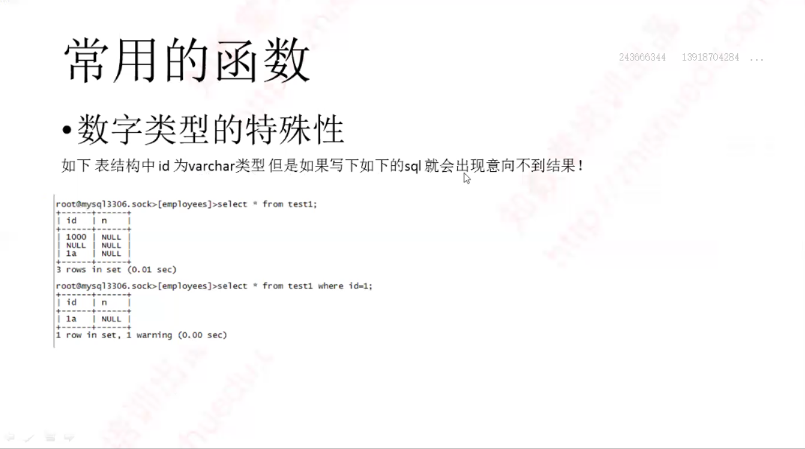

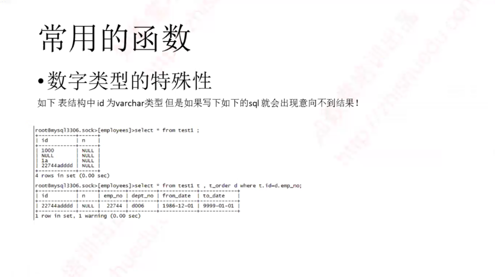

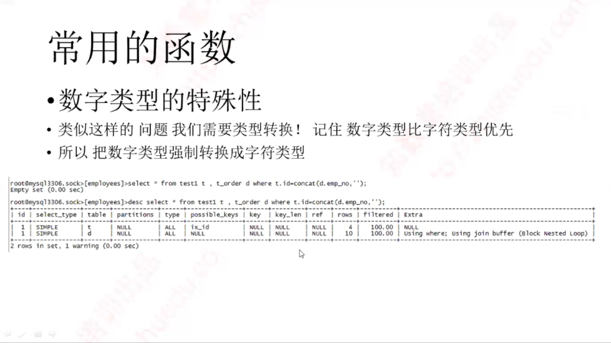

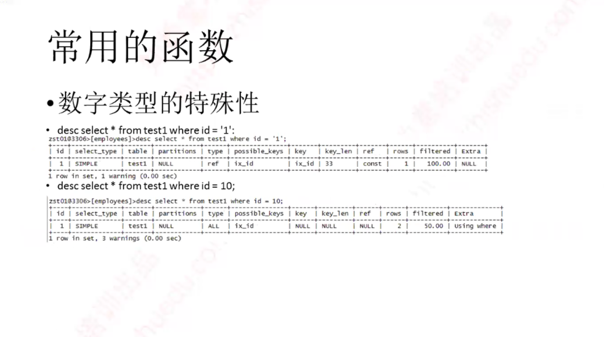


## 笔记

1. 执行计划的查看

   * 5.7开始可以直接使用`desc`
   * 5.6只能用`explain`

2. 时间函数中`sysdate()`参与的列不走索引，因此生产中应该使用`now()`

3. 如何读懂执行计划

   ```shell
   mysql> desc select * from salaries where emp_no=10001 and from_date > now()\G;
   *************************** 1. row ***************************
              id: 1 
     select_type: SIMPLE 			#说明是一个简单的SQL，没有子查询的
           table: salaries			#表名，也有可能是别名
      partitions: NULL				#是否有分区
            type: range			#范围扫描
   possible_keys: PRIMARY,emp_no	#用到的索引，有两个索引
             key: PRIMARY			#主键索引
         key_len: 7				#使用了7个字节长度的主键索引
             ref: NULL				#是否用了“=”过滤
            rows: 1				#预估出了1行数据
        filtered: 100.00			#过滤结果100%
           Extra: Using where		
   # 通过联合主键后预估出了1行数据，其他没有任何过滤条件就100%的返回给客户端        
   ```

   `sysdate()`

   ```shell
   mysql> desc select * from salaries where emp_no=10001 and from_date > sysdate()\G;
   *************************** 1. row ***************************
              id: 1
     select_type: SIMPLE		
           table: salaries
      partitions: NULL
            type: ref				#使用“=”扫描
   possible_keys: PRIMARY,emp_no	#用到的索引
             key: PRIMARY			#主键索引
         key_len: 4				#使用了4个字节长度的主键索引
             ref: const			#表示通过索引一次就找到了
            rows: 17				#预估出了17行数据
        filtered: 33.33			#过滤结果33.33%
           Extra: Using where
   # 联合索引中只使用了emp_no列的索引，没有使用到from_date列的索引，原因在于，使用了sysdate()而不是now()
   ```

   ​

4. sysdate-is-now

   可以通过在配置文件中新增`--sysdate-is-now`参数将`sysdate()`函数等于`now()`

   ```shell
   [root@mastera0 ~]# mysqld --verbose --help|grep sysdate
     --sysdate-is-now    Non-default option to alias SYSDATE() to NOW() to make it
   sysdate-is-now                                               FALSE
   ```

   ​

5. 优化中`lpad()`用的比较多

6. 查询执行计划后可以查看warnings来看建议